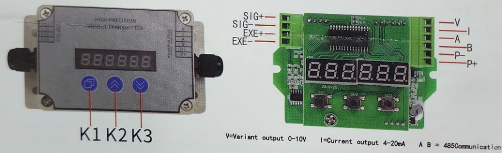
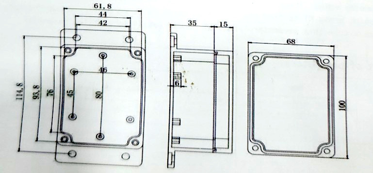
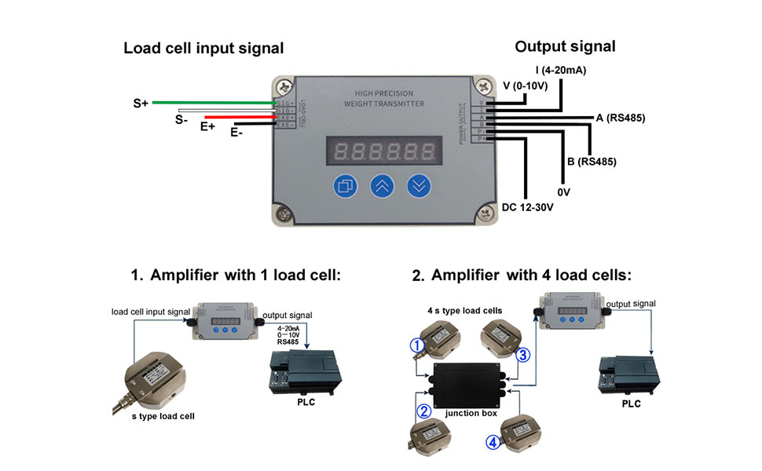

# DY610 Universal weighing power transmitter service manual

## 1. Product profile

The instrument adopts a 24-bit A/D converter, combined with various sensors and transmitters, for measurement, display, alarm monitoring, data collection and recording of pressure, flow, location, component analysis as well as physical parameters such as force and mechanical quantity. The RS485, simulation quantity can be output at 0-10V or 4-20mA.

## 2. Main functions and technical indicators

1.1 Working environment: stable-20-50℃, humidity of 20-90%RH.
1.2 picking rate 20 Secondary / second or 80 Secondary / second。
1.3 High luminance red LED, indication range -99999-999999。
1.4 Power supply voltage is DC12V-30V, power consumption<1W。
1.5 Communication sampling RS485-ModbusRTU protocol, communication rate 0-19200bps(default 9600 / 8 bit data bit / no check / 1 bit stop bit)。
1.6 The transmission output is 0-10V or 4-20mA。
1.7 One of the three available specifications.
1.8 Comprehensive accuracy error was 0.2%.

## 3. Outline dimension and terminal definition



**Enclosure keys:** K1 K2 K3

**PCB Terminal definition:**

- Left side: SIG+, SIG-, EXE+, EXE-
- Right side: V, I, A, B, P-, P+

V=Variant output 0-10V &nbsp;&nbsp;&nbsp; I=Current output 4-20mA &nbsp;&nbsp;&nbsp; A B = 485Communication

**Outline dimensions (mm):**



- Front view: 61.8 x 44 (outer), 42 (inner hole spacing), 114.8 x 93.8 x 76 x 45 x 46 x 80 (mounting hole layout)
- Side view: 35 x 15, hole spacing 6
- Back view: 68 x 100

---

**DAYSENSOR** — 大洋传感系统工程有限公司 电话/Telephone:0552-469-9898 网址/Url: www.dysensor.com

---

## 4. Key instructions

1) Press K1 to enter or exit parameters;
2) Short press K1 to switch the next one, long press K2 to enter the parameter and moving value, change the value by K3, short press K1 to confirm;
3) Restore factory setting: power → press K2, power → for 2 seconds, release K2;

## 5. Calibration instructions

The display limit of this transmitter is 99999, the total range of the sensor shall not be greater than 99999, and the calibration object weight can reach at least 10% of the total sensor range.

2) Under zero zero calibration, press K1 for two seconds, show SL, long press K2 to zero calibration (peeling), enter 00000, and then press K1 to determine.
3) Weight calibration, press K1 to find the weight of the SH, total load range 1 / 10 to remain stable, long press K2 to enter the weight calibration, and enter the weight Weight, then determined by K1, the transmitter shows the object weight value consistent with the calibration value;

## 6. Variant output

For example, a sensor with a range of 1000kg delivers an output of 0-10V or 4-20mA. when weighing a full load

1 voltage output corresponds to positive (V) and negative (P-) ends; current output corresponds to positive (I) and negative (P-) ends;
2 press the K1 entry parameter to find the CZ transmission zero, press K2 to enter, change the size adjustment transmission zero of the parameter value, observe whether the multimeter voltage or current changes to 4mA or 0V;, continue to adjust the parameter value; 4mA≈ 3000, 0V=0000;
3 points press the K1 entry parameter to find the CF full, press K2 to modify the parameter value to observe whether the multimeter changes to 20mA or 10V, and continue to size the parameter value if not arrived; 20mA≈ 15800, 10V=16000;
The ④ point press K1 to find the Cr transmission range parameter, input the total sensor range within this parameter, press K1, and press K1 to exit the parameter;

## 7. List of parameters:

| Number | symbol | Name | Scope | mailing address | Communication function code |
|---|---|---|---|---|---|
| 01 | SL | Zero point calibration value | 00000 | | |
| 02 | SH | Load the calibration value | More than half of the full range | 04X | 0x03, 0x10 |
| 03 | FIL | Digital filtering | 1~99 | 06X | 0x03, 0x10 |
| 04 | Sd | The decimal point position | 0-5 | 08X | 0x03, 0x10 |
| 05 | SZE | On the electricity zero | 0-Do not clear zero; 1- zero clearing | 0AX | 0x03, 0x10 |
| 06 | AS | Acquisition speed | 0-60 Seconds / times; 1-120 Seconds / times | 0CX | 0x03, 0x10 |
| 07 | Id | Differential values | 1, 2, 5, 10, 20 | 0EX | 0x03, 0x10 |
| 08 | CZ | Change to zero | 0-16382 | | |

---

**DAYSENSOR** — 大洋传感系统工程有限公司 电话/Telephone:0552-469-9898 网址/Url: www.dysensor.com

---

| 09 | CF | Variant full degree | 0-16383 | 10X | 0x03, 0x10 |
|---|---|---|---|---|---|
| 10 | Cr | Variant delivery scale | Corresponding to the actual sensor measuring range | 12X | 0x03, 0x10 |
| 11 | CP | Communication mode | 0- Upload actively; 1- ModbusRTU | 14X | 0x03, 0x10 |
| 12 | CA | Communication address | 1-128 | 16X | 0x03, 0x10 |
| 13 | bd | Communication rate | 0-0; 1-4800; 2-9600 ; 3-19200 | 18X | 0x03, 0x10 |
| 14 | SP | Communication stop bit | 1= stop bit 1, 2= stop bit 2 | | |
| 15 | HL | High and low level switch | 0=High in the front ; 1=Low in the front | | |
| | | Current weight value | Read the current weight value | 00X | 0x03 |
| | | Zero display value | (0x05, 0x10 Write 00 with the function code) | 00X | 0x05, 0x10 |
| | | Restore the factory | (0x05, 0x10 Write 00 with the function code) | 03X | 0x05, 0x10 |

## 8. protocol：

Communication is in MODBUS-RTU format; address domain + functional domain + data domain + verification domain
domain:

| function code | meaning | action |
|---|---|---|
| 0x03 | Read the data register | Read the data register values |
| 0x05 | Modify the switch amount | Quickly modify the switch quantity value |
| 0x10 | Modify the data register | Override the multibit data register value |

（Note: 0x05 function code only supports zero clearance and recovery of factory operation, and all other parameters support 0X03 and 0X10 function code）

form:

**Read the data register**

| address | funtion | Data start reg hi | Data start reg lo | Data # of Reg hi | Data # of Reg lo | Crc-16 lo | Crc-16 hi |
|---|---|---|---|---|---|---|---|
| 0x01 | 0x03 | 0x00 | 0x00 | 0x00 | 0x01 | CRC0 | CRC1 |

**Modify the switch amount**

| address | funtion | Data start reg hi | Data start reg lo | Data # of Reg hi | Data # of Reg lo | Crc-16 lo | Crc-16 hi |
|---|---|---|---|---|---|---|---|
| 0x01 | 0x05 | 0x00 | 0x00 | 0xFF | 0x00 | CRC0 | CRC1 |

**Modify the data register**

| address | funtion | Data start reg hi | Data start reg lo | Data # of Reg hi | Data # of Reg lo | Byte count | Value DATA1 | Value DATA2 | Value DATA3 | Value DATA4 | Crc-16 lo | Crc-16 hi |
|---|---|---|---|---|---|---|---|---|---|---|---|---|
| 0x01 | 0x10 | 0x00 | 0x00 | 0x00 | 0x02 | 0x04 | 0x00 | 0x00 | 0x03 | 0xE8 | 0xF3 | 0x22 |

---

**DAYSENSOR** — 大洋传感系统工程有限公司 电话/Telephone:0552-469-9898 网址/Url: www.dysensor.com

---

## Anexo A — Información complementaria (fuente: ATO, mismo equipo DY610)

> Los documentos originales de este anexo provienen de ATO (ato.com), un revendedor que documenta el mismo módulo físico bajo los modelos `ATO-S-LCTR-DY610` y `ATO-LCTR-OAR-DY610`. Se confirmó que es el mismo hardware (idéntica carcasa "HIGH PRECISION WEIGHT TRANSMITTER", mismos botones K1/K2/K3 y mismo layout de terminales SIG+/SIG-/EXE+/EXE-, V/I/A/B/P-/P+). Esta sección se mantiene separada del manual original (Secciones 1-8) para no mezclar fuentes.
>
> **Variante del equipo:** esta unidad es la variante simple **RS485 Modbus RTU / 4-20mA / 0-10V**, sin salidas de relé. La variante "OAR" (Output Alarm Relay) de ATO añade contactos de relé para alarmas de límite superior/inferior y **no aplica a este equipo**.

### A.1 Diagrama de cableado



**Entrada de célula de carga (Load cell input signal):**
- S+ → SIG+
- S- → SIG-
- E+ → EXE+
- E- → EXE-

**Salida de señal (Output signal):**
- I (4-20mA)
- V (0-10V)
- A, B (RS485)
- 0V / DC 12-30V (alimentación)

**Topologías de aplicación:**
1. Amplificador con 1 célula de carga tipo S → salida 4-20mA / 0-10V / RS485 → PLC
2. Amplificador con 4 células de carga tipo S conectadas a una junction box → amplificador → PLC

### A.2 Especificaciones adicionales (ATO datasheet)

| Parámetro | Valor (ATO) | Nota |
|---|---|---|
| Excitation voltage | DC 5V (datasheet) / DC 5-15V (manual protocolo) | El manual chino original no especifica este valor |
| Output signal (opcional) | DC 4-20mA, DC 0-10V, RS485 (Modbus-RTU), 4-20mA & RS485, 0-10V & RS485 | Las combinaciones "salida analógica + RS485 simultánea" no se mencionan en el manual chino |
| Sampling rate | 60, 120 times/s (datasheet ATO) vs. 20, 80 times/s (manual original) | ⚠️ Discrepancia — posible diferencia de revisión/firmware entre fuentes; verificar en campo con el parámetro `AS` |
| Readout units | kg, g, ton, newtons | No especificado en el manual chino |
| Protection class | IP65 | No especificado en el manual chino |

### A.3 Funciones de teclas y funcionalidad adicional confirmada (ATO)

El manual de usuario ATO (`ATO-load-cell-amplifier-user-manual-ATO-LCTR-OAR.pdf`) nombra explícitamente la función de cada tecla, información que el manual chino original no detalla:

| Tecla | Función (ATO) |
|---|---|
| K1 | Set key (tecla de ajuste / entrar-salir de parámetros) |
| K2 | Shift key or confirm key (desplazar dígito / confirmar) |
| K3 | Tare key or add key (tara / incrementar valor) |

**Función adicional no documentada en el manual chino** — monitor de valor AD crudo:

> "Under display interface, long press K2 key will display current AD value, long press K2 key again to exit."
>
> Bajo la interfaz de visualización normal, mantener presionada la tecla K2 muestra el valor AD (crudo, sin escalar) actual; mantener presionada K2 nuevamente para salir.

Esta función es genérica del módulo base (no requiere la variante OAR) y es útil para diagnóstico de la señal cruda del sensor sin depender de la calibración de escala.

### A.4 Aclaración de nomenclatura de parámetros (manual chino vs. ATO)

Ambas fuentes describen el mismo mapa de registros base (Sección 7-8 de este manual). La redacción en inglés del manual chino es en ocasiones ambigua; ATO usa una nomenclatura más clara para el mismo parámetro:

| Símbolo | Nombre — manual chino (original) | Nombre — ATO (aclaración) |
|---|---|---|
| SL | Zero point calibration value | Zero calibration value |
| SH | Load the calibration value | Load calibration value |
| FIL | Digital filtering | Digital filtering |
| Sd | The decimal point position | Decimal point position |
| SZE | On the electricity zero | **Power-on reset zero** |
| AS | Acquisition speed | Collecting speed |
| Id | Differential values | **Division value** |
| CZ | Change to zero | Zero calibration |
| CF | Variant full degree | Full scale calibration |
| Cr | Variant delivery scale | Transmitting range calibration |
| CP | Communication mode | Communication mode |
| CA | Communication address | Communication address |
| bd | Communication rate | Communication baud rate |
| SP | Communication stop bit | Communication stop bit |
| HL | High and low level switch | High and low switch |

Las aclaraciones más útiles son **SZE** (confirma que es "poner a cero al energizar", no una lectura eléctrica ambigua) e **Id** (confirma que es el "valor de división/incremento mínimo de display", no "valores diferenciales").

### A.5 Protocolo Modbus-RTU extendido — Tablas completas (variante OAR, NO aplica a este equipo)

> ⚠️ Todo el contenido de esta subsección (A.5) proviene de `ATO-load-cell-amplifier-Modbus-RTU-protocol-ATO-LCTR-OAR.pdf` y documenta la variante **OAR (Output Alarm Relay)**, que añade salidas de relé para alarmas de límite superior/inferior. **Esta unidad (RS485 Modbus RTU simple) no tiene estas salidas de relé y estos registros probablemente no existen ni responden en su firmware.** Se transcribe completo por valor de referencia técnica, pero no debe usarse para programar este equipo sin verificación previa contra la unidad física.

#### A.5.1 Formato de trama y ejemplos de comunicación

Formato: `nn` = código de máquina (dirección esclavo), `crc0` = byte bajo del CRC, `crc1` = byte alto del CRC. Todos los datos en hexadecimal.

| Ejemplo | Trama |
|---|---|
| Send — leer valor medido | `nn 03 00 00 00 01 crc0 crc1` |
| Return — valor medido | `nn 03 04 d1 d2 crc0 crc1` (d1 d2 = dato firmado de 2 bytes) |
| Send — modificar primer valor de comparación / límite superior | `nn 10 00 28 00 02 04 d1 d2 d3 d4 crc0 crc1` (d1-d4 = valor fijo de 4 bytes, byte alto primero) |
| Return — confirmación de escritura | `nn 10 00 28 00 02 crc0 crc1` |
| Send — clear (borrar) | `nn 05 00 00 ff 00 crc0 crc1` |
| Return — confirmación clear | `nn 05 00 00 ff 00 crc0 crc1` |

Notas de formato: baud rate soportado 2400-115200; longitud máxima de trama 60 bytes; comandos soportados 03, 05, 0x10.

#### A.5.2 Tabla 1 — Parámetros del amplificador y dirección de comunicación (variante OAR)

| Mínimo | Máximo | Valor inicial | Decimales | Válido | Dirección comunicación (decimal) | Descripción |
|---|---|---|---|---|---|---|
| 0 | 999999 | 5000 | 14 | 1 | 40 | Upper limit value (valor límite superior) |
| 0 | 999999 | 1000 | 14 | 1 | 42 | Lower limit value (valor límite inferior) |
| 0 | 999 | 5 | 14 | 1 | 44 | Hysteresis (histéresis) |
| 1 | 40 | 10 | 0 | 1 | 46 | Digital filtering (filtrado digital) |
| 0 | 5000 | 10 | 0 | 1 | 48 | Stability range (rango de estabilidad) |
| 0 | 6 | 1 | 0 | 1 | 50 | Zero tracking (seguimiento de cero) |
| 0 | 5 | 2 | 0 | 1 | 52 | Percentage of the range: 0=0%; 1=2%; 2=5%; 3=20%; 4=50%; 5=100% |
| 0 | 50000 | 200 | 0 | 1 | 54 | Manual set zero, range setting (ajuste manual de cero, configuración de rango) |
| 0 | 7 | 4 | 0 | 1 | 56 | Communication baud rate: 0=0; 1=2400; 2=4800; 3=9600; 4=19200; 5=38400; 6=57600; 7=115200 |
| 0 | 1 | 0 | 0 | 1 | 58 | Communication mode: 0=Modbus; 1=active upload |
| 0 | 1 | 0 | 0 | 1 | 60 | Data Format: 0=n81; 1=n82 |
| 1 | 8 | 1 | 0 | 1 | 62 | Address (dirección esclavo) |
| 1 | 50000 | 100 | 3 | 1 | 64 | Actively transmit interval and calibrate segment numbers (intervalo de transmisión activa y número de segmentos de calibración) |
| 1 | 6 | 1 | 0 | 0 | 66 | Division value (valor de división) |
| 0 | 4 | 2 | 0 | 1 | 68 | Decimal point (punto decimal) |
| 10 | 999999 | 50000 | 14 | 1 | 70 | Transmitting range (rango de transmisión) |
| 10000 | 30000 | 20000 | 4 | 1 | 72 | Sensitivity of load cell (sensibilidad de la célula de carga) |
| 10 | 999999 | 50000 | 14 | 1 | 74 | Range of load cell (rango de la célula de carga) |
| 0 | 999999 | 0 | 0 | 1 | 76 | Zero AD (AD de cero) |
| 0 | 9999999 | 100000 | 0 | 1 | 78 | Corresponding weight of range coefficient (peso correspondiente al coeficiente de rango) |
| 0 | 4 | 3 | 0 | 1 | 80 | Collecting speed: 0=5; 1=10; 2=20; 3=40; 4=80 (muestras/s) |
| 0 | 1 | 0 | 0 | 1 | 82 | Magnification times: 0=64; 1=128 |
| 0 | 4095 | 0 | 0 | 1 | 84 | Transmitting zero calibration (calibración de cero de transmisión) |
| 0 | 4095 | 4000 | 0 | 1 | 86 | Transmitting range calibration (calibración de rango de transmisión) |
| 0 | 5000 | 0 | 0 | 1 | 88 | 13: zero of load cell ad (AD de cero de la célula de carga) |
| 5000 | 999999 | 260000 | 21 | 1 | 90 | 14: full range of load cell ad (AD de rango completo de la célula de carga) |
| 0 | 5000 | 0 | 0 | 1 | 92 | (sin descripción en el documento fuente) |
| 0 | 65000 | 0 | 0 | 1 | 94 | (sin descripción en el documento fuente) |

*Nota del documento fuente: todos los parámetros de esta tabla soportan lectura y escritura por comunicación — lectura con comando 03, escritura con comando 16 (0x10).*

#### A.5.3 Tabla 2 — Datos en tiempo real (comando 03)

| Dirección comunicación | Parámetro | Rango | Lectura/Escritura |
|---|---|---|---|
| 0 | Net weight (peso neto) | Dato largo con signo | Read-only |
| 2 | Current inner code (código interno actual) | Dato sin signo | Read-only |
| 4 | Operating status (estado operativo) | — | — |
| 6 | Transmitting code value (valor de código de transmisión) | 0-4095 | Read and write |

#### A.5.4 Tabla 3 — Operaciones del comando 0x05 (variante OAR)

Códigos de comando (según qué dato se escribe en la dirección correspondiente, para ejecutar distintas operaciones):

| Código | Operación |
|---|---|
| 1 | Clear (borrar) |
| 2 | Restore factory, excluyendo baud rate y código de máquina |
| 3 | Restore factory completo |
| 4 | Hardware zero calibration (calibración de cero por hardware) |
| 5 | Hardware full range calibration (calibración de rango completo por hardware) |
| 6 | Digital calibration (calibración digital) |
| 7 | Communication control transmission output — válido |
| 8 | Communication control transmission output — inválido |

| Dirección comunicación | Función | Observaciones |
|---|---|---|
| 0 | Clear | AD escrito a 1 es válido |
| 3 | Restore factory (excluyendo baud rate y código de máquina) | AD escrito a 1 es válido |
| 4 | Restore factory completely | AD escrito a 1 es válido |
| 5 | Hardware zero calibration | AD escrito a 1 es válido |
| 6 | Hardware full range calibration | AD escrito a 1 es válido |
| 7 | Digital calibration | AD escrito a 1 es válido |
| 8 | Communication control transmission output is valid | AD escrito a 1 es válido; escrito a 0, la salida de transmisión es inválida |

#### A.5.5 Registro de estado operativo (`WorkData[20]`) y direcciones 0-40

> "The communication address 0-40 corresponds to the following data (read-only data). Multiply the following serial number by 2 is the communication address. Only serial number 11 (DA) is the read and write data."
>
> La dirección de comunicación = número de serie × 2 (todas de solo lectura, excepto el índice 11 = DA, que es lectura/escritura).

```c
unsigned long xdata WorkData[20];
//0  Net weight (peso neto)
//1  Gross weight (peso bruto)
//2  Current zero = Fad0 (cero actual)
//3  Current filter (filtro actual)
//4  10d corresponding ad code (código AD correspondiente a 10 divisiones)
//5  Operating status (estado operativo):
//     bits 7:0   AD collecting and counting 0-19
//     bits 15:8  Fault: 8=memory read error, 12=memory write error
//     bit 16     stable (estable)
//     bit 17     zero (en cero)
//     bits 24:25 DO1 DO2 status (estado de relés — SOLO variante OAR)
//6  AD for full range in calibration (AD para rango completo en calibración)
//7  Weight calibration (calibración de peso)
//8  Temporary parameter displays refresh record (registro de refresco de parámetros temporales en pantalla)
//9  Temporary parameter calibration (calibración de parámetros temporales)
//10 Judging stability and counting (evaluación de estabilidad y conteo)
//11 DA (único índice de lectura/escritura)
```

#### A.5.6 Protocolo de transmisión activa

> "The amplifier transmits data actively at regular intervals (parameter code 13), and the data format is 8 bytes ASC data and a carriage-return, such as 123.456 (carriage-return), the corresponding hexadecimal number is 2d 31 32 33 2e 34 35 36 0d. When using active transmission, the communication rate should not be too low, otherwise, it will block."

El amplificador transmite datos activamente a intervalos regulares (parámetro de dirección 64, "actively transmit interval"), en formato ASCII de 8 bytes seguido de retorno de carro (CR). Ejemplo: `123.456<CR>` = `2d 31 32 33 2e 34 35 36 0d` en hexadecimal. Con transmisión activa, la velocidad de comunicación no debe ser demasiado baja o se bloqueará el canal.

### A.6 Notas de instalación y operación (traducción completa)

Numeración según el documento fuente. Se marca con ✅ las que aplican de forma genérica a este equipo (RS485 simple) y con ⚠️ las que son específicas de funciones no presentes en esta unidad.

1. ✅ **Pasos para calibración digital:** el amplificador se calibra en fábrica para cero y rango completo por hardware. Antes de usar, el cliente solo necesita configurar la sensibilidad y el rango de la célula de carga, y luego realizar la calibración digital. La sensibilidad debe ser un valor preciso.
2. ⚠️ Cuando el control de transmisión está habilitado (vía comando 05 o comando 16), el valor de salida analógica puede modificarse escribiendo el valor de código de transmisión. Cuando la salida de transmisión está inválida, la salida es controlada por el valor medido. *(Depende de registros de la Tabla 1/A.5.2 — variante OAR)*
3. ✅ Restaurar la configuración de fábrica por comando de comunicación puede causar interrupción de la comunicación; los parámetros de comunicación deben configurarse según el baud rate y código de máquina recuperados de fábrica.
4. ✅ El protocolo RS485 general no tiene un estándar fijo de pines; puede variar según el orden y funciones de pines de cada fabricante.
5. ✅ Verificar el diagrama de pines RS485 del producto específico (ver Sección 3 y Anexo A.1 de este manual).
6. ✅ Cada amplificador debe conectarse uno por uno (daisy-chain); no debe haber conexión en estrella ni cruzada — de lo contrario, la interferencia será muy alta y puede resultar en comunicación deficiente o nula.
7. ✅ Usar preferentemente cable de par trenzado apantallado (blindaje a tierra); en su defecto, cable de par trenzado simple. No usar cable común, ya que genera mucha interferencia. Longitud máxima del cable de comunicación: 1200 metros.
8. ✅ Conectar una resistencia terminadora si es necesario, para mejorar la inmunidad al ruido del sistema.
9. ✅ La versión estándar del amplificador soporta hasta 32 unidades conectadas simultáneamente en la misma línea RS485; para redes de mayor escala se requiere personalización.
10. ✅ Los terminales del cable de comunicación deben estar firmemente conectados, sin holgura — de lo contrario el amplificador puede dañarse (quemarse).

---

**Fuentes de este anexo:** `docs/ATO-S-LCTR-DY610.docx`, `docs/ATO-load-cell-amplifier-user-manual-ATO-LCTR-OAR.pdf`, `docs/ATO-load-cell-amplifier-Modbus-RTU-protocol-ATO-LCTR-OAR.pdf`

---

## Anexo B — Guía práctica: Workflow de instalación y ajuste

> Esta sección es una **guía práctica sintetizada**, no una transcripción literal del manual. Reorganiza en orden operativo la información ya documentada en las Secciones 1-8 y en el Anexo A, con referencias cruzadas a cada punto. Úsala como checklist de puesta en marcha; consulta la sección referenciada para el detalle textual completo.

### Fase 0 — Verificación previa

- [ ] Confirmar que el rango total de la célula de carga **no supera 99999** en la escala de display, y que el peso de calibración disponible alcanza **al menos el 10%** del rango total del sensor *(ref. Sección 5)*.
- [ ] Definir qué salida se va a usar: **V (0-10V)**, **I (4-20mA)** y/o **RS485 (A/B)** — las tres pueden coexistir, pero solo se calibra/configura la(s) que se vaya(n) a usar *(ref. Sección 3, Sección 6)*.
- [ ] Si se usará RS485, decidir de antemano: dirección de esclavo (`CA`), baud rate (`bd`), bit de parada (`SP`) y orden de bytes (`HL`) *(ref. Sección 7, filas 12-15)*.

### Fase 1 — Instalación mecánica

- [ ] Fijar el gabinete usando el patrón de taladros: 114.8 × 93.8 (exterior), 76 × 45/46/80 (taladros de montaje) *(ref. Sección 3, plano de dimensiones — `images/2.jpg`)*.
- [ ] Dejar acceso a los prensaestopas laterales para el cableado de célula de carga (izquierda) y de alimentación/salida (derecha), según el diseño del gabinete *(ref. Sección 3, foto — `images/1.jpg`)*.

### Fase 2 — Cableado eléctrico

- [ ] **Entrada de célula de carga:** S+ → `SIG+`, S- → `SIG-`, E+ → `EXE+`, E- → `EXE-`. Si el cable de la célula tiene blindaje, conectarlo a `EXE-` *(ref. Anexo A.1, diagrama de cableado)*.
- [ ] **Alimentación:** DC 12-30V *(ref. Sección 2, punto 1.4; Anexo A.1)*.
- [ ] **Salida analógica (si aplica):** `V` (0-10V) o `I` (4-20mA) referenciados a `P-` *(ref. Sección 3, terminal definition)*.
- [ ] **Salida RS485 (si aplica):** `A`/`B` *(ref. Sección 3)*. Aplicar buenas prácticas de bus: par trenzado apantallado, conexión en cadena (no en estrella), máx. 1200 m, hasta 32 equipos en la línea, resistencia terminadora si es necesaria *(ref. Anexo A.6, notas 4-9)*.
- [ ] Si son varias células de carga: usar junction box y conectar cada celda tipo S individualmente antes de llegar al amplificador *(ref. Anexo A.1, topología "4 células de carga")*.
- [ ] Verificar que todos los terminales queden firmemente atornillados — una conexión floja puede dañar el equipo *(ref. Anexo A.6, nota 10)*.

### Fase 3 — Encendido inicial y verificación de señal

- [ ] Energizar el equipo y confirmar que el display muestra un valor (no error).
- [ ] (Opcional, diagnóstico) Mantener presionada **K2** en la interfaz normal para ver el **valor AD crudo** del sensor antes de calibrar — útil para confirmar que la célula de carga responde físicamente a la carga *(ref. Anexo A.3)*.

### Fase 4 — Calibración de cero (SL)

1. [ ] Sin carga sobre la célula, presionar **K1** durante 2 segundos hasta que el display muestre `SL`.
2. [ ] Mantener presionado **K2** para entrar en modo de calibración de cero (tara); debe quedar en `00000`.
3. [ ] Confirmar con **K1**.
*(ref. Sección 4, puntos 1-2; Sección 5, punto 2)*

### Fase 5 — Calibración de carga / span (SH)

1. [ ] Colocar sobre la célula un peso patrón conocido — **al menos el 50% del rango total** (ver Fase 0) *(ref. Sección 5, punto 3; Anexo A confirma "more than half of full scale" en ambas fuentes)*.
2. [ ] Presionar **K1** hasta llegar al parámetro `SH`.
3. [ ] Mantener presionado **K2** para entrar en edición; usar **K2** para desplazar dígito y **K3** para modificar el valor, ingresando el peso real conocido.
4. [ ] Confirmar con **K1** — el display debe mostrar el valor de peso consistente con el patrón usado.
*(ref. Sección 4; Sección 5, punto 3)*

### Fase 6 — Ajustes de display (opcionales, según aplicación)

Configurar solo si el valor por defecto no es adecuado — todos se editan con el mismo procedimiento K1 (navegar) → K2 (entrar/editar) → K3 (modificar) → K1 (confirmar) *(ref. Sección 4)*:

| Parámetro | Qué ajusta | Rango | Ref. |
|---|---|---|---|
| `FIL` | Filtrado digital (estabilidad vs. velocidad de respuesta) | 1~99 | Sección 7, fila 03 |
| `Sd` | Posición del punto decimal | 0-5 | Sección 7, fila 04 |
| `SZE` | Poner a cero automáticamente al energizar | 0=no; 1=sí | Sección 7, fila 05 |
| `AS` | Velocidad de adquisición | 0-60 / 1-120 seg/veces | Sección 7, fila 06 |
| `Id` | Valor de división (incremento mínimo de display) | 1, 2, 5, 10, 20 | Sección 7, fila 07 |

### Fase 7 — Configuración de la salida analógica V/I (solo si se usa 0-10V o 4-20mA)

1. [ ] Navegar con **K1** hasta `CZ` (zero de transmisión). Entrar con **K2**, ajustar con **K3** mientras se observa el multímetro en la salida V o I, hasta que marque **0V** o **4mA** (valor de referencia orientativo: `CZ`≈0000 para 0V, ≈3000 para 4mA). Confirmar con **K1**.
2. [ ] Navegar hasta `CF` (fondo de escala de transmisión). Entrar con **K2**, ajustar con **K3** hasta que el multímetro marque **10V** o **20mA** (valor de referencia orientativo: `CF`≈16000 para 10V, ≈15800 para 20mA). Confirmar con **K1**.
3. [ ] Navegar hasta `Cr` (rango de transmisión) e ingresar el **rango total real de la célula de carga** (p. ej. 1000 kg) para que la salida analógica escale correctamente sobre ese rango. Confirmar con **K1** y salir con **K1**.
*(ref. Sección 6, puntos 1-4; valores de referencia verificados contra el escaneo original)*

### Fase 8 — Configuración de comunicación RS485 (solo si se usa Modbus-RTU)

1. [ ] Configurar `CA` — dirección de esclavo (1-128) *(Sección 7, fila 12)*.
2. [ ] Configurar `bd` — velocidad: 0=0, 1=4800, 2=9600, 3=19200 *(Sección 7, fila 13)*. Default de fábrica: 9600 *(Sección 2, punto 1.5)*.
3. [ ] Configurar `SP` — bit de parada: 1 o 2 *(Sección 7, fila 14)*.
4. [ ] Configurar `HL` — orden de bytes alto/bajo: 0=alto primero, 1=bajo primero *(Sección 7, fila 15)* — **crítico** para interpretar correctamente el valor leído desde el maestro Modbus.
5. [ ] Verificar `CP` — modo de comunicación: 0=subida activa, 1=ModbusRTU *(Sección 7, fila 11)* — debe estar en modo ModbusRTU si se va a hacer polling desde un maestro.
6. [ ] Probar lectura con función `0x03` sobre la dirección `00X` (peso actual) desde el maestro Modbus y confirmar que el valor coincide con el display *(ref. Sección 7, tabla; Sección 8, tabla "Read the data register")*.

### Fase 9 — Verificación final

- [ ] Retirar el peso patrón y confirmar que el display vuelve a `00000` (o cerca, dentro de tolerancia).
- [ ] Volver a aplicar el peso patrón y confirmar repetibilidad de la lectura.
- [ ] Si se usa salida V/I: confirmar en el multímetro que 0% carga = valor `CZ` calibrado y 100% carga = valor `CF` calibrado.
- [ ] Si se usa RS485: confirmar que el valor leído por comunicación coincide con el display en al menos 2 puntos de carga distintos.
- [ ] Documentar los valores finales de `SL`, `SH`, `FIL`, `Sd`, `CZ`, `CF`, `Cr`, `CA`, `bd`, `SP`, `HL` para referencia futura.

### Fase 10 — Troubleshooting

- **Error de configuración / display errático:** restaurar de fábrica: apagar → mantener presionado **K2** → encender → esperar 2 segundos → soltar **K2** *(ref. Sección 4, punto 3)*.
- **Interrupción de comunicación tras un restore:** si se restauró vía comando de comunicación (no aplica al restore físico con K2), los parámetros de comunicación vuelven a su valor de fábrica (baud rate y dirección) — reconfigurar el maestro Modbus en consecuencia *(ref. Anexo A.6, nota 3)*.
- **Comunicación RS485 intermitente o nula:** revisar que no haya conexión en estrella/cruzada, usar cable apantallado, verificar longitud (<1200 m) y terminales firmes; agregar resistencia terminadora si es una línea larga *(ref. Anexo A.6, notas 4-10)*.
- **Sospecha de sensor/celda dañada:** usar el monitor de valor AD crudo (mantener K2) para confirmar que el valor cambia físicamente al aplicar carga, antes de sospechar de la configuración *(ref. Anexo A.3)*.

---

## Anexo C — Diagnóstico de fallas de comunicación RS485/Modbus-RTU (investigación externa: foros y documentación técnica)

> Esta sección **no proviene de los manuales del DY610/ATO**, sino de investigación externa en foros técnicos (Control.com, PLCTalk, Electronics StackExchange, Digi Forums, Teltonika Community, Inductive Automation Forum) y guías de aplicación de fabricantes (Chipkin, Industrial Monitor Direct, ABB, Transcell, Rinstrum). Se incluye porque los síntomas de falla de comunicación RS485/Modbus-RTU son en gran medida genéricos de la capa física del estándar y aplican directamente a este equipo. Cada punto cita su fuente.

### C.1 Checklist rápido de diagnóstico (orden recomendado)

Según [SiteConduit — Modbus RTU Troubleshooting Checklist](https://siteconduit.com/kb/modbus/rtu-troubleshooting-checklist): *"Modbus RTU communication failures almost always trace back to one of four root causes: mismatched serial settings (baud rate, parity, data bits, stop bits), incorrect RS-485 wiring or polarity, wrong slave ID configuration, or register addressing errors. Work through the physical layer first, then serial parameters, then protocol settings."*

Orden de diagnóstico recomendado:
1. **Capa física** — cableado, polaridad A/B, tierra común, terminación/polarización.
2. **Parámetros seriales** — baud rate, paridad, bits de datos, bit de parada (deben coincidir en ambos extremos).
3. **Parámetros de protocolo** — dirección de esclavo (`CA`), function code, dirección de registro.
4. **Validación con un punto conocido** — leer un registro simple (p. ej. peso actual, dirección `00X`, function code `0x03`) con una herramienta independiente (Modbus Poll, QModMaster, Modbus Doctor) antes de confiar en el sistema SCADA/PLC final.

### C.2 Tabla resumen: síntoma → causa probable → solución

| Síntoma | Causa probable | Solución |
|---|---|---|
| Sin respuesta en absoluto (timeout) | Cableado, dirección incorrecta, parámetro serial mal configurado | Verificar capa física primero, luego parámetros seriales — [Voltrus](https://voltrus.id/blog/modbus-rtu-troubleshooting) |
| Error de CRC ocasional o constante | Ruido eléctrico, mala terminación, bucle de tierra, polaridad A/B invertida | Revisar cableado → terminación → conexión a tierra — [Voltrus](https://voltrus.id/blog/modbus-rtu-troubleshooting), [Chipkin CRC guide](https://docs.chipkin.com/articles/modbus-crc-lrc-error-checking-and-troubleshooting/) |
| Respuesta de excepción (function code + 0x80) | Dirección de registro o function code incorrecto/no soportado | Verificar que el maestro usa exactamente los registros y function codes documentados en la Sección 7-8 |
| Fallas intermitentes, funciona a veces | Problema de temporización half-duplex, carga del bus, direcciones duplicadas | Bajar la velocidad de polling, verificar direcciones únicas — [forumautomation.com](https://forumautomation.com/t/modbus-protocol-troubleshooting-issue/12197) |
| Valor leído completamente absurdo (ej. 655360 en vez de 10) | Orden de bytes/palabras (endianness) incorrecto | Ver sección C.7 — invertir el orden de palabras en el maestro, o ajustar `HL` en el equipo |
| Funciona en banco de pruebas pero falla instalado en planta | Referencia de tierra distinta entre extremos (ground potential difference) | Añadir cable de tierra común entre los extremos del bus — ver sección C.3 |
| Falla solo cuando arrancan motores/variadores (VFD) cercanos | Ruido de modo común acoplado por los cables del VFD | Ver sección C.8 — separar cableado, blindaje, chokes de modo común |
| Un dispositivo del bus nunca responde, aunque los demás sí | Se excede el límite de 32 unit loads, o resistencias de polarización mal configuradas en varios equipos a la vez | Ver sección C.5 — revisar resistencias de terminación/bias activadas en más de un equipo |
| Comunicación funciona con un adaptador USB-RS485 pero no con otro | Adaptador USB de baja calidad, sin bias interno, temporización pobre | Probar con otro adaptador; agregar bias externo — ver sección C.4 |

### C.3 Polaridad A/B y referencia de tierra común

**Polaridad A/B invertida** es la causa más común de "sin respuesta total". Según [Industrial Monitor Direct](https://industrialmonitordirect.com/blogs/knowledgebase/modbus-rs-485-no-response-fixing-ab-wiring-polarity): *"the TIA/EIA-485 standard defines A as the inverting terminal and B as the non-inverting terminal, but many device manufacturers reverse this... Reversed RS-485 polarity will not damage drivers or transceivers, the bus will simply fail to interpret data correctly."* Es decir, **es seguro probar invertir A/B** como primer paso de diagnóstico — no genera daño.

**Falta de referencia de tierra común (GND)**: aunque RS485 es "diferencial de 2 hilos", en la práctica casi todas las fuentes coinciden en que se recomienda un tercer conductor de referencia. Según [SiteConduit](https://siteconduit.com/kb/modbus/rtu-troubleshooting-checklist): *"A third conductor for signal reference ground is not required by RS-485 but is strongly recommended, especially for runs longer than 15 meters or where devices are powered from different electrical panels. Without a common ground reference, voltage differences between device grounds can exceed the RS-485 common-mode range (±7V), causing communication failures."*

Un caso real documentado en el foro de [control.com](https://control.com/forums/threads/modbus-communication-problems.34415/) sobre indicadores de peso industriales específicamente advierte: *"Grounding issues on the RS-485 links are by far the largest single cause of field failures in these industrial instrumentation equipment."* — y describe dos escenarios típicos: (A) usar RS485 como bus de "solo 2 hilos" sin referencia de tierra, y (B) el bus atraviesa dos dominios de tierra distintos (edificios/subestaciones distintas), lo que puede causar fallas catastróficas en los transceptores por corrientes de tierra excesivas.

**Recomendación práctica:** conectar un cable de referencia de tierra (GND/0V) entre todos los nodos del bus RS485, además de A/B, especialmente si el cableado supera 15 m o si los equipos se alimentan desde tableros eléctricos distintos.

### C.4 Terminación y polarización (bias) del bus

Según la [guía de capa física de Chipkin](https://docs.chipkin.com/articles/modbus-rs485-physical-layer-wiring-and-termination-reference/):

- **Terminación:** exactamente 2 resistencias de 120Ω (o 150Ω según la especificación Modbus), una en cada extremo físico del tramo troncal — nunca en derivaciones (stubs) ni en dispositivos intermedios.
- **Polarización (bias):** cuando ningún dispositivo transmite, el bus queda en alta impedancia; sin resistencias de polarización, el ruido puede generar bits de inicio falsos. Se recomienda pull-up de 450-650Ω en la línea B(+) hacia 5V y pull-down de igual valor en A(-) hacia GND — **solo en un punto del bus**, no en cada dispositivo.
- ⚠️ **Advertencia real de campo** ([PLCTalk.net](https://www.plctalk.net/threads/modbus-rtu-and-rs485.142961/)): un técnico reportó que activar los switches de terminación en **más de un** equipo WAGO (que además de terminación de 150Ω agregan un par de resistencias de bias de 390Ω) consumía casi todo el presupuesto de 32 "unit loads" del bus, causando que el 5º dispositivo de 5 nunca respondiera. Solución: dejar la terminación/bias activada en **un solo equipo** (o usar resistencias externas discretas en los dos extremos físicos del bus), no en cada esclavo.

Este equipo (DY610) no dispone de switches de terminación/bias internos conocidos — si se requieren, deben agregarse externamente en los dos extremos físicos del tramo troncal.

### C.5 Topología del bus y número de nodos

- RS485 es un **bus** (daisy-chain), no una **estrella**. Conexiones en estrella o cruzadas generan reflejos de señal e interferencia severa — coincide exactamente con la nota 6 del Anexo A.6 (fuente ATO) y con [Chipkin](https://docs.chipkin.com/articles/modbus-rs485-physical-layer-wiring-and-termination-reference/): *"RS-485 expects a bus, not a star. Long stubs and mid-run terminations create a link that can appear healthy during light testing and fail later under sustained polling."*
- Límite estándar: **32 unit loads** por segmento (equivalente a 32 dispositivos con transceptores de carga estándar 1 unit-load); usar repetidores/aisladores RS485 para redes más grandes.
- Un caso de [PLCTalk.net](https://www.plctalk.net/threads/modbus-rtu-and-rs485.142961/) confirma que **probar cada dispositivo individualmente antes de conectarlos todos en cadena** ayuda a aislar si el problema es de un equipo puntual o de la topología del bus completo.

### C.6 Parámetros seriales y direccionamiento

- **Todos los nodos del bus deben compartir exactamente**: baud rate, paridad, bits de datos y bit de parada. Un solo parámetro distinto en un equipo produce fallo total de comunicación en ese nodo — [SiteConduit](https://siteconduit.com/kb/modbus/rtu-troubleshooting-checklist). En este equipo, estos parámetros corresponden a `bd` y `SP` (Sección 7, filas 13-14).
- **Direcciones de esclavo duplicadas** (`CA` en este equipo, Sección 7 fila 12) causan respuestas intermitentes o datos corruptos por colisión en el bus — verificar que cada equipo en la línea tenga una dirección única.
- Según [control.com](https://control.com/forums/threads/modbus-communication-problems.34415/): *"aunque el protocolo Modbus indica que 'sin paridad' debería usar 2 bits de parada, algunos drivers de dispositivo no soportan 2 bits de parada. La solución es usar paridad par/impar con 1 bit de parada."* Si hay problemas persistentes con `SP=2` (2 bits de parada), probar con paridad activada y `SP=1`.
- **Iniciar con baud rate bajo** (p. ej. 9600) para establecer comunicación primero, y subir la velocidad después una vez confirmado el enlace físico — recomendación de campo de [control.com](https://control.com/forums/threads/modbus-communication-problems.34415/).

### C.7 Orden de bytes/palabras (endianness) — relevante al parámetro `HL` de este equipo

Este es un problema **extremadamente común y bien documentado** al leer valores multi-registro (32 bits) por Modbus, y aplica directamente al parámetro `HL` ("High and low level switch", Sección 7 fila 15) de este equipo.

Un caso real en [StackOverflow](https://stackoverflow.com/questions/43486223/modbus-rtu-data-received-is-not-correct) con un indicador de peso industrial (Precia Molen i30) muestra exactamente este síntoma: el indicador mostraba `10`, pero el maestro Modbus leía `655360` (= 0x0A0000 en vez de 0x0A) — diagnóstico: *"You have an endianness problem... your OPC server is reading both registers but concatenating them in the wrong order. Check in the OPC server manual how to swap the register order."*

Según la [nota de aplicación de Elkor](https://elkortechnologies.com/pdfs/AN1702-Understanding_Modbus_Registers.pdf): *"Per the Modbus Standard, 16-bit registers are big-endian... sin embargo, para tipos de datos de 32 bits, el estándar Modbus no define el orden y los fabricantes no lo implementan de forma consistente. Tanto el maestro como el esclavo deben usar el mismo orden de palabras."*

**Aplicación práctica para este equipo:** si al leer el peso por Modbus obtienes un valor absurdamente grande o incorrecto (pero el display local es correcto), antes de sospechar de un error de datos:
1. Verificar el valor de `HL` (0=alto primero, 1=bajo primero, Sección 7 fila 15) y que coincida con la convención esperada por tu maestro Modbus.
2. Si tu maestro/SCADA permite "swap words" o "byte swap" para registros de 32 bits, probar activarlo/desactivarlo.
3. Usar un valor de peso conocido en báscula para validar contra el valor bruto leído por comunicación, tal como recomienda la guía de [ACE Automation](https://www.support.aceautomation.eu/knowledge-base/precise-stable-weight-measurement-with-load-cell-rs485-transmitter-connection-to-hmi/) para transmisores de peso RS485 similares: *"To simplify operation... we've set 'ModBus Doctor' to 32 bits word and ticked the Swap words box, giving a decimal result straight away."*

### C.8 Ruido EMI de variadores de frecuencia (VFD) y motores — relevante en entornos industriales de pesaje

Frecuente en instalaciones de pesaje industrial (tolvas, básculas de banda, silos) donde el cableado RS485 comparte bandeja o cercanía con motores/variadores.

Un caso documentado en [Electronics StackExchange](https://electronics.stackexchange.com/questions/745381/modbus-rtu-interference) describe exactamente este escenario: comunicación estable con los variadores apagados, pero con timeouts y errores de CRC frecuentes al activarlos. Diagnóstico: ruido de modo común acoplado por las líneas de entrada del sensor, que termina circulando también por el cable RS485. Cita clave: *"That's common practice and wrong. The RS485 cable should be shielded, twisted pair, and the shield connected to the Ground terminal of the Modbus devices at both ends"* — **solo si los puertos son aislados galvánicamente**; si no lo son, conectar el blindaje en ambos extremos puede crear un bucle de tierra en vez de resolverlo.

Recomendaciones combinadas de [Industrial Monitor Direct](https://industrialmonitordirect.com/blogs/knowledgebase/resolving-rs-485-modbus-network-noise-from-vfd-interference) y [ABB](https://library.e.abb.com/public/19382ad529ef49f0803e1ec89fbbf6b3/LVD-EOTKN121U-EN_RS-485designandinstallbestpractices_REVA.pdf):

- Separar el cableado RS485 de los cables de potencia/salida de VFD: mínimo 300 mm si el cable de potencia va <10m paralelo, más si es más largo.
- Usar cable apantallado específico para VFD (foil + trenza) en las salidas del variador, no solo en el bus RS485.
- Conectar el blindaje del cable RS485 a tierra **en un solo punto** (normalmente en el extremo del maestro/PLC) para evitar bucles de tierra.
- Considerar chokes/núcleos de ferrita de modo común en el cableado RS485 cerca de la fuente de ruido.
- Si es posible, reducir la frecuencia de conmutación (carrier frequency) del variador (p. ej. de 8-16 kHz a 4 kHz) — suele reducir el ruido EMI a costa de un ligero aumento de ruido audible del motor.

### C.9 Adaptadores USB-RS485 de baja calidad

Varios hilos de foro ([logicmachine.net](https://forum.logicmachine.net/showthread.php?tid=1401), [Electronics StackExchange](https://electronics.stackexchange.com/questions/735517/rs-485-transmission-problem-modbus-rtu)) documentan casos donde el mismo cableado y configuración funciona con un adaptador USB-RS485 y falla con otro, debido a:
- Ausencia o debilidad de resistencias de polarización internas en el adaptador.
- Temporización deficiente en la activación/desactivación del driver half-duplex (importante porque los frames Modbus-RTU se delimitan por silencio de 3.5 caracteres — [Electronics StackExchange](https://electronics.stackexchange.com/questions/750269/modbus-rtu-sending-90-gibberish-10-useful-data-inconsistent-working-addres)).
- Chips USB-serial genéricos (p. ej. CH340) de menor calidad de reloj/temporización que interfaces industriales dedicadas.

**Recomendación práctica:** si la comunicación falla de forma inconsistente con un adaptador USB-RS485 de bajo costo, probar con un segundo adaptador (idealmente uno industrial con aislamiento galvánico) antes de sospechar del equipo DY610.

### C.10 Notas adicionales de cableado de célula de carga (relevante a este equipo)

Según la [guía de cableado de Transcell](https://transcell.com/load-cell-wiring-guide/), aplicable al cableado SIG+/SIG-/EXE+/EXE- de este equipo (ref. Sección 3 y Anexo A.1):

| Síntoma | Causa probable | Solución |
|---|---|---|
| Sin señal (lectura en cero con carga aplicada) | Conductor roto, EXC+ y EXC- invertidos | Verificar continuidad en los 4 conductores; confirmar polaridad de excitación |
| Lectura errática / saltos | Terminal flojo, humedad en el prensaestopas, blindaje conectado en ambos extremos | Reapretar terminales (0.5-0.8 N·m); resellar prensaestopas; desconectar blindaje en el extremo de la célula |
| Zumbido de 60Hz / ruido AC en la señal | Bucle de tierra (blindaje conectado en ambos extremos) o cable paralelo a línea de potencia AC | Conectar el blindaje **solo en el extremo del indicador/transmisor**; separar el cable de líneas de potencia AC al menos 15 cm |

Regla general citada: *"Ground the shield at the indicator end only. Grounding at both ends creates a ground loop... One-point shield grounding is the industry-standard practice for every manufacturer of industrial weighing equipment."* — coincide con la recomendación de blindaje a `EXE-` ya documentada en el Anexo A.1 de este manual.

---

**Fuentes de este anexo (investigación externa, no oficiales del fabricante):** Control.com Forums, PLCTalk.net, Electronics StackExchange, Digi Technical Support Forums, Teltonika Community, Inductive Automation Forum, forumautomation.com, StackOverflow, SiteConduit KB, Chipkin Automation Systems docs, Industrial Monitor Direct KB, ABB application note LVD-EOTKN121U-EN, Elkor Technologies AN1702, Transcell load cell wiring guide, ACE Automation Europe support KB. Enlaces citados inline junto a cada punto.
