# User's Manual

## THT03R

**Temperature and Humidity Transmitter**

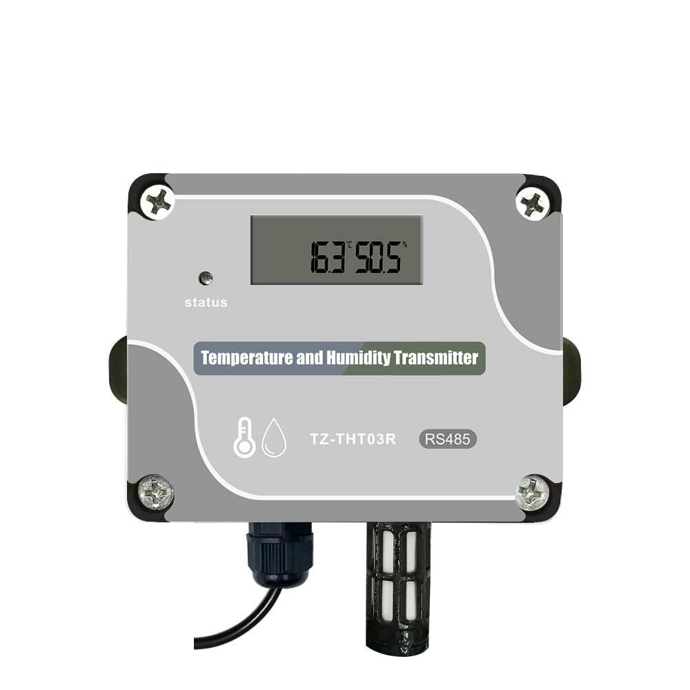

*Figure 1 — General view of the THT03R transmitter. The unit has a light-grey aluminium front panel mounted on a dark ABS housing, secured by four cross-head (Phillips) corner screws. In the upper area, a segmented LCD shows the live readings (top line = humidity, bottom line = temperature); to its left a small round status indicator LED is marked "status". The panel is silk-screened with the legend "Temperature and Humidity Transmitter", a thermometer/water-drop icon, the model "TZ-THT03R" and the bus type badge "RS485". At the bottom, a cable gland brings out the power/communication cable, and a perforated metal cap protects the SHT30 sensing probe.*

---

# Overview

The THT03R temperature and humidity transmitter is designed based on the RS-485 communication interface, compatible with the standard Modbus-RTU protocol, and can be connected to a Modbus network to achieve temperature and humidity measurement and monitoring.

The THT03R sensing element uses the SHT30, a newly designed CMOSens chip combining an improved capacitive humidity sensor element and a standard band-gap temperature sensor element. Its performance has been greatly improved and even exceeds the previous generation of sensors (SHT1x and SHT7x), with a reliability level that makes its performance in high-humidity environments more stable.

The THT03R adopts the DIP-switch address-setting method, which avoids the need to use the host computer to set the address in advance, making it simple, convenient and easy to maintain and replace.

The THT03R adds a display screen and indicator light, so users can more intuitively see the current temperature and humidity data and the machine status.

The THT03R has excellent long-term stability, low latency, low power consumption, strong resistance to chemical pollution and excellent repeatability. It is an ideal solution for accurate temperature and relative humidity measurement in HVAC, communication equipment rooms, warehouse buildings and automatic-control applications.

## Appearance

| | |
|---|---|
| 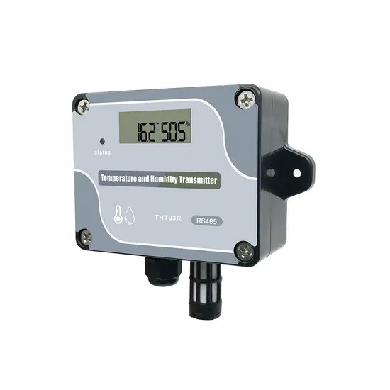 | 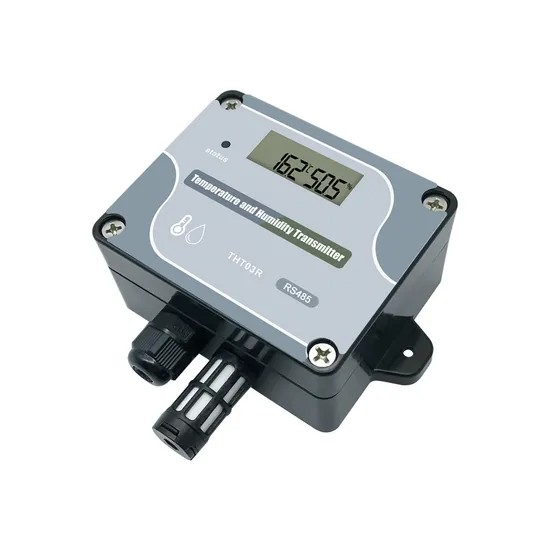 |
| 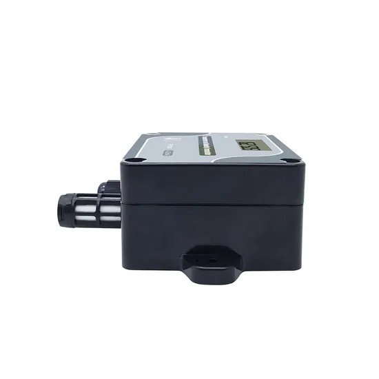 | 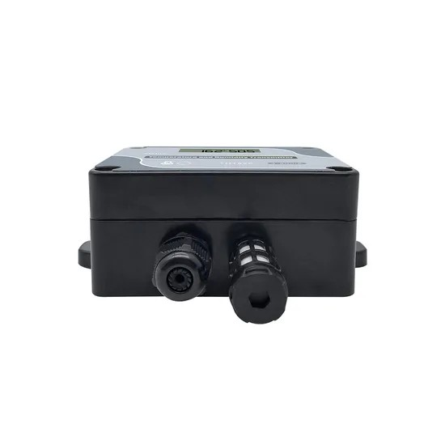 |

*Figure 1b — Additional views of the THT03R. **Top-left:** three-quarter front view; the dark wall-mounting bracket with two screw holes is visible on the right side of the housing. **Top-right:** angled rear-quarter view showing the integrated mounting flange/ear with a fixing hole used to screw the unit to a wall. **Bottom-left:** side profile, showing the cable gland and the moulded mounting tab. **Bottom-right:** bottom view showing the two glands that emerge from the base — on the left the cable gland for the power/RS-485 cable, and on the right the perforated cap protecting the SHT30 sensing probe.*

---

# Features

- Low power consumption
- Fully calibrated
- High precision and good consistency
- Long-term stability, low drift
- Humidity full-range temperature compensation
- Standard Modbus-RTU protocol
- Strong interface protection capability and stable communication
- LCD display and status indicator light
- DIP-switch address setting (no host computer required)

---

# Application fields

Generally used in indoor clean environments, such as:

- HVAC
- Building automation
- Laboratory, hospital, library
- Storage and production facilities in the pharmaceutical, paper, food and electronics industries
- Cold-chain logistics, pharmaceutical and drug distribution
- Temperature/humidity control and monitoring of freezers, warehouses, workshops and greenhouses

---

# Quick start guide

This section is a practical summary for getting the transmitter connected and reading data. Full details are in the referenced sections.

### Step 1 — Wire the device

Connect the 4-pole terminal block (inside the housing, see §2 and §1.5):

| Terminal | Connect to |
|---|---|
| **VCC** | Power supply **+** (DC 5~36 V) |
| **GND** | Power supply **−** (common ground) |
| **A** | Terminal **A** of the RS-485 bus / converter |
| **B** | Terminal **B** of the RS-485 bus / converter |

Use an **RS-232/USB-to-RS-485 converter** between the PC and the bus. For multiple units, wire all A together, all B together, and all GND together (see the diagram in §1.6). Tie the common ground to the converter ground; the shield of a shielded cable may be used as the ground wire.

### Step 2 — Set the device address

Set the Modbus slave address with the 8-position DIP switch (see §2). The address is the sum of the weights of the positions set to **ON** (128/64/32/16/8/4/2/1). Each device on the same bus must have a **unique** address. Open the housing by removing the four corner screws to access the switch.

### Step 3 — Configure the serial port

Default communication parameters:

| Setting | Value |
|---|---|
| Baud rate | **9600** bps (also supports 4800) — see §3.5 to change |
| Data bits | 8 |
| Parity | None |
| Stop bits | 1 |

So the serial frame is **9600-8-N-1** (or **4800-8-N-1**).

### Step 4 — Read temperature and humidity (Modbus function 03)

Registers: **0 = temperature**, **1 = relative humidity** (both signed, unit 0.1; value `7FFF` = sensor fault). Send a function-03 read request. Example frames below assume slave **address 01** (use your configured address and recompute the CRC):

| Action | Request frame (hex) | Notes |
|---|---|---|
| Read **temperature + humidity** (regs 0–1) | `01 03 00 00 00 02 C4 0B` | 2 registers from address 0 |
| Read **temperature only** (reg 0) | `01 03 00 00 00 01 84 0A` | |
| Read **humidity only** (reg 1) | `01 03 00 01 00 01 D5 CA` | |
| Read **all 8 registers** (0–7) | `01 03 00 00 00 08 44 0C` | full example in §3.4 |

**Decoding the response** (see worked example in §3.4): each value is a 16-bit big-endian signed integer in units of 0.1. For example a temperature word `00 FA` = 0x00FA = 250 → **25.0 °C**, and a humidity word `02 58` = 0x0258 = 600 → **60.0 %RH**.

### Step 5 — (Optional) Change the baud rate (Modbus function 06)

Write register **5** with the desired baud rate value (`0x2580` = 9600, `0x12C0` = 4800):

| Action | Request frame (hex) |
|---|---|
| Set baud rate to **9600** | `01 06 00 05 25 80 82 FB` |
| Set baud rate to **4800** | `01 06 00 05 12 C0 95 3B` |

> **Tip:** the status LED is steady red while powered and blinks once each time data is read — a quick way to confirm the host is polling the device. All CRC-16 values use the Modbus polynomial (see §3.7); when you change a frame's address or data you must recompute the 2-byte CRC.

---

# 1. Technical data

## 1.1 Parameters

| Item | Parameter |
|---|---|
| Supply Voltage | DC 5~36V |
| Current | 5mA |
| Transfer Protocol | 485 port, standard Modbus-RTU |
| Transmission Rate | 4800bps / 9600bps |
| Display Screen | Keep the power on, the screen will be bright, and the temperature and humidity display are accurate to one decimal place |
| Indicator Light | Keep the power on, it will be red, and it will flash once when reading the data. |

---

## 1.2 Transmission distance

The standard maximum transmission distance is about 1200 meters, depending on the use environment, transmission material and transmission rate.

| Item | Parameter |
|---|---|
| Number of theoretical nodes | 32 |

---

## 1.3 Temperature and Humidity Parameters

| Item | Parameter |
|---|---|
| Sensing Element | SHT30 |
| Measuring Range | -40°C~125°C; 5%~95%RH |
| Resolution | 0.1°C, 0.1%RH |
| Measurement Accuracy | Temperature: ±0.3°C (0~60°C); ±0.5°C for other range. Humidity: ±2%RH (10%~90%RH); ±5%RH for other range |
| Long-term Stability | <±0.03°C/year (under no pollution) |
| Lifetime | 1 year (It is recommended to calibrate once a year) |
| RH Hysteresis | <±0.8%RH |
| RH Response Time | About 8s (from 33%RH to 75%RH, in flowing air) |
| RH Long-term Stability | <±0.25%RH/year (under no pollution) |

---

## 1.4 Environmental conditions

| Item | Parameter |
|---|---|
| Working Environment | -40°C~85°C / 0~100%RH (Non-condensing) |
| Storage Environment | -40°C~85°C / 0~100%RH (Non-condensing) |

---

## 1.5 Electrical connections

| Label | Function description |
|---|---|
| B | Terminal B of RS485 interface |
| A | Terminal A of RS485 interface |
| GND | Public ground (connect to the negative end of the power supply when DC power is supplied) |
| VCC | Power supply positive (when DC power supply is connected to the positive terminal of the power supply) |

---

## 1.6 Schematic diagram of connection with PC

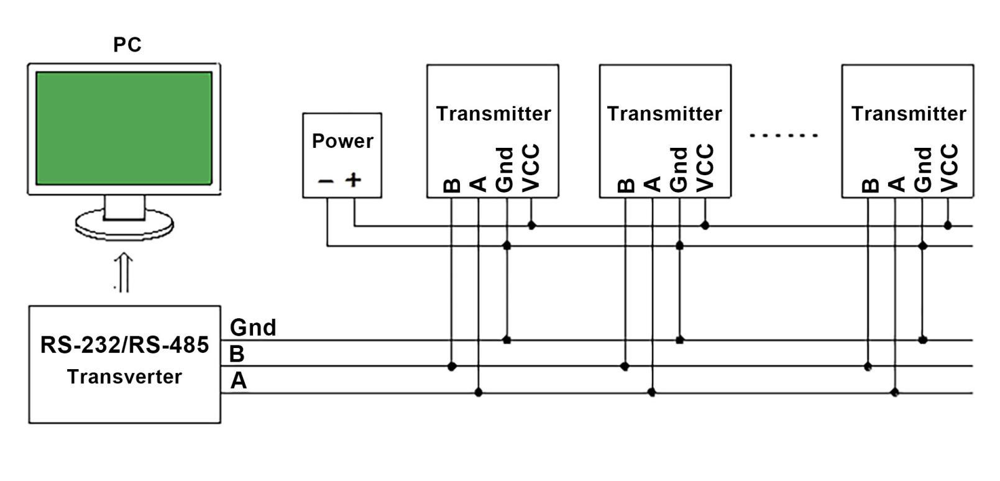

*Figure 2 — Typical RS-485 network topology. A PC connects to an RS-232/RS-485 converter ("Transverter"), whose three signal lines — Gnd, B and A — run as a common bus. Multiple transmitters are wired in parallel onto this bus: every transmitter's B terminal joins the bus B line, every A terminal joins the bus A line, and every Gnd joins the common ground. A separate DC power source ("Power", − / +) feeds the VCC and Gnd terminals of all transmitters in parallel. The dotted "……" indicates that further transmitters can be daisy-chained onto the same bus (up to the 32 theoretical nodes given in §1.2).*

**Note:**  
When setting up a RS485 network, pay attention to the RS485 grounding treatment to eliminate the common mode voltage. Suggest to connect the common ground of each sensor together, and then connect it to the ground wire of the RS-232/RS-485 transverter. To connect, you can use the shielding layer of the shielded wire as the ground wire.

---

## 1.7 Temperature and humidity update time

| Item | Parameter |
|---|---|
| Temperature and humidity update time | Update temperature and humidity data every 30s |

---

## 1.8 Physical and general specifications

> The values in this table come from the manufacturer's published product datasheet (TZONE / Made-in-China listing) and complement the electrical and sensing parameters above.

| Item | Parameter |
|---|---|
| Model | THT03R |
| Installation type | Wall-mounted |
| Housing material | ABS + stainless steel |
| Net dimensions | 109 × 100 × 40 mm (see §4 for the dimensioned drawing) |
| Ingress protection | IP55 |
| Operating temperature (electronics) | -40°C ~ +85°C |
| Output / interface | RS-485, Modbus-RTU |
| Certification | CE (manufacturer also lists FCC, RoHS) |
| Warranty | 1 year |
| Package size | 36 × 30 × 41 cm (box) |
| Gross weight | ~9 kg per package |

> **Note on temperature ranges.** The sensing **measuring range** is given in §1.3 (-40°C ~ 125°C). The -40°C ~ +85°C figure above is the **operating/working environment** range of the electronics, as also stated in §1.4.

---

# 2. DIP switch and address code

## Dialing Diagram

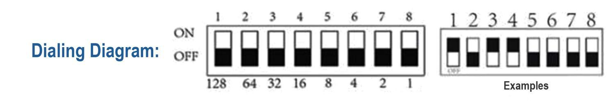

*Figure 3 — Address-code dialing chart. The left block shows the 8-position DIP switch: each rocker can be set to **ON** (up) or **OFF** (down), and the positions 1–8 carry the binary weights 128, 64, 32, 16, 8, 4, 2 and 1 respectively. The address code is the sum of the weights of all positions set to ON. The right block, labelled "Examples", shows a sample switch pattern with several rockers toggled to illustrate how a particular combination is read.*

**Note:**  
The above picture is a schematic diagram of the DIP switch. The DIP switch has 8 DIP positions. The corresponding numbers from 1 to 8 are 128, 64, 32, 16, 8, 4, 2, 1, and these values are added together as the address code. As shown in the figure above, bits 1, 3, and 4 are in the ON position, so the address code is 128+32+16=176, that is, the address code is 176.

## Steps to set the address

| First step | Second step |
|---|---|
| 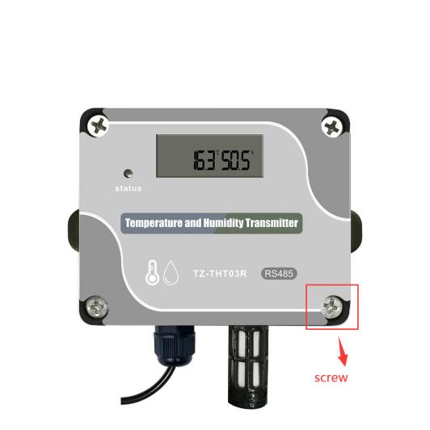 | 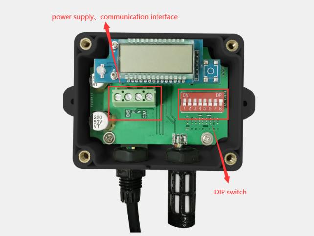 |

*Figure 4 — Procedure to open the housing and set the address. **First step (left):** the front panel of the assembled transmitter is shown with one of the four corner fixing screws highlighted by a red box and a "screw" label, indicating the fasteners that must be removed. **Second step (right):** with the cover removed, the internal PCB is exposed. The 4-pole green screw terminal block on the left (red box, labelled "power supply / communication interface") provides the B, A, GND and VCC connections, while the 8-way red DIP switch on the right (red arrow, labelled "DIP switch") is used to set the Modbus address. The LCD, the status LED and a push-button are also visible on the board.*

**Step 1:** use a screwdriver to unscrew the four corner screws in the figure, as shown in the figure above.  
**Step 2:** Turn on the DIP switch to set the address, as shown in the second step above, the part circled on the left is the power communication interface. The connection method has been explained in the electrical connection in 1.5, please read it carefully note!

---

# 3. Protocol

## 3.1 Data frame format (default format of the sensor)

| Start bit | Data bit | Parity bit | Stop bit |
|---|---|---|---|
| 1 | 8 | 0 | 1 |

---

## 3.2 RTU message frame format

THT-02 follows the RTU information frame protocol. In order to ensure the integrity of the information frame, a pause time of 3.5 characters or more is required at the beginning and end of each information frame (T1-T2-T3-T4, this time can be based on the wave Calculated by special rate), each byte of information frame needs to be transmitted continuously. If there is a pause time greater than 1.5 characters, the sensor will treat it as invalid information and will not respond.

| Start | Address | Function code | Data area | CRC check | End |
|---|---|---|---|---|---|
| T1-T2-T3-T4 | 1 byte | 1 byte | N byte | 2 byte | T1-T2-T3-T4 |

---

## 3.3 Register definition

| Register Address | Meaning | Description | Read and write |
|---:|---|---|---|
| 0 | Temperature | The unit is 0.1 degree, MSB First, complement format, 7FFF H means the sensor is abnormal | Read only |
| 1 | Relative humidity | The unit is 0.1%, MSB First, complement format, 7FFF H means the sensor is abnormal | Read only |
| 2 | Reserved 1 | — | Read only |
| 3 | Reserved 2 | — | Read only |
| 4 | Address code | Set by DIP switch | Read only |
| 5 | Baud rate | Support 4800, 9600 | Can read and write |
| 6 | Hardware version | — | Read only |
| 7 | Software version | — | Read only |

---

## 3.4 Host reads sensor information (function code 03)

The sensor allows the host to use the function code 03 to read the temperature and humidity measurement value of the sensor and other information. The information frame format of the 03 code is as follows:

### Host request information frame

| Field Description | Example |
|---|---|
| Slave address | 01 |
| Function code | 03 |
| Register address high byte | 00 |
| Register address low byte | 00 |
| High byte of query quantity | 00 |
| Low byte of query quantity | 08 |
| CRC check code low byte | 44 |
| CRC check code high byte | 0C |

### Sensor response information frame

| Field Description | Example |
|---|---|
| Slave address | 01 |
| Function code | 03 |
| Return the number of bytes | 10 |
| Temperature data high byte | 00 |
| Temperature data low byte | FA |
| Humidity data high byte | 02 |
| Low byte of humidity data | 58 |
| 1 high byte reserved | 00 |
| 1 low byte reserved | 00 |
| 2 high byte reserved | 00 |
| 2 low byte reserved | 00 |
| Address code high byte | 00 |
| Address code low byte | 01 |
| Baud rate high byte | 25 |
| Baud rate low byte | 80 |
| Hardware version high byte | 06 |
| Hardware version low byte | 00 |
| Software version high byte | 00 |
| Software version low byte | 0A |
| CRC check code low byte | D4 |
| CRC check code high byte | 64 |

### Data analysis

Temperature = 00FAH = 250 / 10 = 25.0°C  
Humidity = 0258H = 600 / 10 = 60.0%RH;  
Reserved 1 = 0000H;  
Reserved 2 = 0000H;  
Address code = 0001H = 1;  
Baud rate = 2580H = 9600;  
Hardware version = 0600H;  
Software version = 000AH = 10 = V1.0;

**Note:** If users only want to read the temperature and humidity or other registers, they only need to read the corresponding registers.

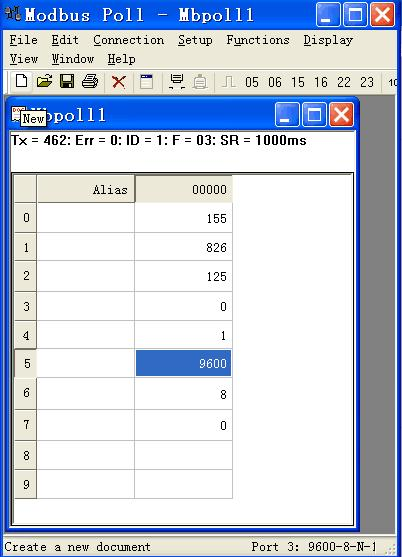

*Figure 5 — Example of reading the registers with the Modbus Poll software (function code 03). The status line shows `ID = 1: F = 03: SR = 1000ms`, i.e. polling slave address 1 with function 03 every 1000 ms. The register list reads, from top to bottom: register 0 = 155 (temperature 15.5 °C), register 1 = 826 (humidity 82.6 %RH), register 2 = 125 and register 3 = 0 (reserved), register 4 = 1 (address code), register 5 = 9600 (baud rate), register 6 = 8 and register 7 = 0 (hardware/software version). The serial port at the bottom is configured as 9600-8-N-1.*

---

## 3.5 Host setting sensor information (function code 06)

This machine can currently set the baud rate (register address is 0005H), and the message frame format is as follows:

### Host request information frame

| Field description | Example |
|---|---|
| Slave address | 01 |
| Function code | 06 |
| Register address high byte | 00 |
| Register address low byte | 05 |
| Set value high byte | 25 |
| Set value low byte | 80 |
| CRC check code low byte | 82 |
| CRC check code high byte | FB |

### Sensor response information frame

| Field description | Example |
|---|---|
| Slave address | 01 |
| Function code | 06 |
| Register address high byte | 00 |
| Register address low byte | 05 |
| Set value high byte | 25 |
| Set value low byte | 80 |
| CRC check code low byte | 82 |
| CRC check code high byte | FB |

**Data analysis:** Set the baud rate to 9600.

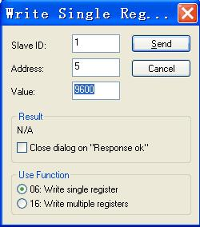

*Figure 6 — Example of setting the baud rate with the "Write Single Register" dialog of the Modbus Poll software (function code 06). The fields are set to Slave ID = 1, Address = 5 (the baud-rate register) and Value = 9600, with the "06: Write single register" function selected. Pressing **Send** writes the new baud rate to the transmitter.*

---

## 3.6 Abnormal response

When the host sends request information to the sensor, various errors may occur. At this time, the sensor sets the highest position of the function code to 1, and then returns an error code. The host can determine whether an error has occurred by detecting whether the highest bit of the function code is 1.

### Return format

| Slave address | Function code | Error code | CRC check |
|---|---|---|---|
| 1 byte | 1 byte | 1 byte | 2 byte |

### Error code

| Error code | Meaning |
|---|---|
| 01 | Illegal function code |
| 02 | Illegal data address |
| 03 | Illegal data value |

---

## 3.7 CRC check code

RTU mode uses CRC-16 check, the check code occupies 2 bytes, if the check code is wrong, the sensor will ignore the host's request and not respond.

The calculation method of CRC-16 check code is as follows:

1. Preset a 16-bit register as hexadecimal FFFF, call this register CRC register;
2. XOR the first 8-bit binary data (the first byte of the information frame) with the lower 8 bits of the 16-bit CRC register, and place the result in the CRC register;
3. Shift the content of the CRC register one bit to the right (toward the low bit) and fill the highest bit with 0, check the right shift out position after shift;
4. If the shifted out bit is 0, repeat step 3 (shift one bit to the right again), if the shifted out bit is 1, the CRC register is XORed with the polynomial A001 (1010 0000 0000 0001);
5. Repeat steps 3 and 4 until the right shift is 8 times, so that the entire 8-bit data has been processed;
6. Repeat steps 2 to step 5 to process the next byte of the message frame;
7. After calculating all the bytes of the information frame according to the above steps, the content of the CRC register obtained is: 16-bit CRC check code.

---

# 4. Dimensions (unit: mm)

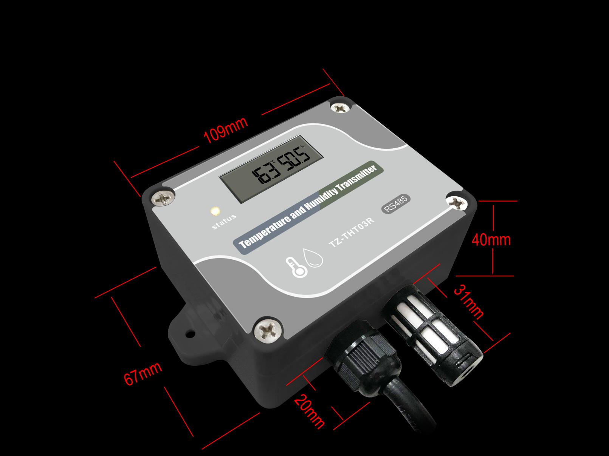

*Figure 7 — Overall dimensions of the THT03R transmitter (in millimetres). The body measures **109 mm** wide and **67 mm** high. From the bottom edge, the cable gland projects about **20 mm**, and the sensor probe assembly extends a further **40 mm**, with the perforated probe cap being about **31 mm** long. The mounting flange with its fixing hole is visible on the left side of the housing. The manufacturer's datasheet lists the overall net size as **109 × 100 × 40 mm**.*

---

# Document sources

- Original printed user manual (*User's Manual — THT03R*): basis for the body text and parameter tables.
- PDF *TZ THT-03R Temperature and humidity transmitter — User Manual V1.1* (`2956a8d629d.pdf`): source of the extracted figures (Figures 1–7) and of the Overview / Features / Application-fields and Dimensions sections.
- Manufacturer product listing (TZONE Digital Technology Co., Ltd., Made-in-China): source of the additional appearance photos (Figure 1b), the physical/general specifications in §1.8, and the extended application fields.

> **Version note:** the printed manual and the V1.1 PDF differ in a few sensing figures (e.g. measuring range and temperature accuracy). Where they differ, this manual follows the **printed manual**. See §1.3 for the authoritative measuring range and accuracy.
