# ADF400L Series Multi User Electric Energy Meter

## Installation and Operation Manual V1.2

---

**Acrel Electric Co., Ltd**

---

## Declare

The copyright is the property of Acrel. Any information in any paragraph or section cannot be extracted, copied or otherwise reproduced or propagated. Otherwise offenders shall take all consequences.

All rights are reserved.

Acrel reserves the right to modify the product specifications herein without notification. Please consult the local agent about the latest specifications before placing a purchase order.

---

## Contents

| Section | Description | Page |
|:--------|:------------|:-----|
| 1 | Overview | 1 |
| 2 | Product specifications | 1 |
| 3 | The main function | 2 |
| 4 | Technical Parameters | 3 |
| 5 | Shape and installation dimensions | 4 |
| 6 | Wiring and installation | 6 |
| 7 | Function Description | 9 |
| 8 | Show description | 10 |
| 9 | Communication description | 16 |
| 10 | Common troubleshooting | 37 |

---

## 1 Overview

The ADF400L series multi-user electric energy meter can achieve up to 12 three-phase or 36 single-phase direct access measurement or 12 three-phase mutual inductor access measurement, a hybrid of direct access and mutual inductor access through module combination measurement method. This series of electric energy meters are popular among communities, schools, enterprises, etc. due to their high accuracy, centralized installation, centralized management, high installation flexibility, and non-interference.

---

## 2 Product specifications

### 2.1 Product naming

```
ADF400L-□H□S□D□-□
  │
  ├─ Optional function: none, CE, IC, K, *C (up to 3 channels)
  ├─ Control type: none: metering type; Y: prepaid type
  ├─ Single-phase circuit: up to 36 (multiple of 3) circuits
  ├─ Three-phase circuit: up to 12 circuits
  └─ Three mutual inductor access loop: up to 12 (multiple of 2) channels
```

**Note:**
1. The product consists of main module, direct access module and transformer access module.
2. The product leaves the factory according to the module combination method.
3. The maximum combination of products can achieve 12 three-phase measurements (3 single-phase can be converted into 1 three-phase loop).

### 2.2 Product module description

#### Main module

| Feature | Description |
|:--------|:------------|
| Power Supply | Three-phase 3×220/380V power supply to provide working power for the back-end measurement module |
| Man-machine interface | LCD and button programming |
| Infrared communication | Infrared communication |
| RF card swiping | RF card swiping (IC function) |
| RS485 communication | 2 RS485 network communication (\*C function) |
| RS485 for extended module | RS485 communication for No. 3 extended wireless module (RJ45 connection mode) |
| DI/DO | Up to 2DI/2DO (K function) |
| Ethernet | Up to 1 Ethernet communication (CE function) |

#### Direct access to the measurement module

| Feature | Description |
|:--------|:------------|
| Measurement | It can realize one-way three-phase 3×10(80) measurement or three-way single-phase 10(80) A measurement |
| Pulse output | 1 active energy pulse output |
| LED indication | Three-phase working status, pulse and communication status LED indication |

#### Transformer access measurement module

| Feature | Description |
|:--------|:------------|
| Measurement | Two-way three-phase 3×1(6) A measurement can be realized |
| Pulse output | 2 active energy pulse output |
| LED indication | 2 three-phase working status, pulse and communication status LED indication |
| DI/DO | Up to 4DI/4DO function (K function) |

---

## 3 The main function

### 3.1 Prepaid Features

| Feature | Description |
|:--------|:------------|
| Energy metering | Total active energy, forward and reverse active energy, multi-rate active energy measurement |
| Electricity measurement | UI, P, Q, S, PF, F |
| LCD display | 8-digit segment LCD display, backlight display |
| Button programming | Key programmable communication, number of loops, single three-phase mode, external control mode and other parameters |
| Pulse output | Active pulse output |
| Multiple rate | Support 4 time zones, 2 time slots, 14 daily time slots, 4 rates |
| Main module communication | Date, time, day of the week; Infrared communication; Up to 3 channels of communication: RS485 interface |
| Protocol | Also support Modbus |
| Prepaid agreement (remote, radio frequency card) | Cost control (including forward active power and reverse active power); Time control; Negative control (malignant load identification); Strong control |
| Recharge record | 20 Articles |

### 3.2 Metering type

| Feature | Function Description |
|:--------|:--------------------|
| Display method | LCD (Field) |
| Energy metering | Active energy metering — Forward and reverse; Reactive power measurement — Forward and reverse |
| Electricity measurement | Voltage, current (zero sequence current), power factor, frequency, active power, reactive power, apparent power |
| Harmonic function | Total harmonic content, sub-harmonic content (2~31 times) |
| Three-phase unbalance | Voltage and current unbalance |
| DI/DO | Main module 2DI2DO; Transformer access to the slave module 2DI4DO (direct access to the slave module without) |
| LED Instructions | Pulse light indication |
| Communication | Infrared communication; RS485 interface (main module) supports MODBUS |
| Historical power | Historical Electricity in Last December |

---

## 4 Technical parameter

| Technical Parameter | ADF400L-HSD(Y)- |
|:--------------------|:-----------------|
| **Auxiliary power** | |
| Voltage | Three-phase 3×220V/380V power supply (for single-phase power supply, short-circuit terminals 1, 2, and 3 on the instrument) |
| Power consumption | ≤10 W |
| **Voltage input** | |
| Rated voltage | 3×220/380V, 3×57.7/100V |
| Reference frequency | 50 Hz |
| **Current input** | |
| Input Current | 3×1(6)A (Instrument transformer access), 3×10(80) (direct access) |
| Starting current | 1‰Ib |
| **Measuring performance** | |
| Measurement accuracy | 0.5s level |
| Clock accuracy | ≤0.5 s/d |
| **Pulse** | |
| Pulse output | Each three-phase metering module has 1 active energy pulse output |
| Pulse Width | 80 ms ± 20 ms |
| Pulse constant | 3×1(6)A specification: 6400 imp/kWh; 3×10(80)A specification: 400 imp/kWh |
| **Switch** | |
| Main module | Main module 2DI+2DO. Among them, DI is dry contact input |
| Slave module | Transformer access slave module 4DI+4DO. Among them, DI is 220V wet contact input |
| **Communication** | |
| Infrared interface | Infrared communication |
| RS485 interface | MODBUS-RTU |
| Ethernet interface | Modbus-TCP, TCP/IP |
| **Surroundings** | |
| Temperature | Operating temperature: -20~+60 °C; Storage temperature: -30~+70 °C |
| Humidity | ≤95% RH, No condensation, no corrosive gas place |
| Altitude | ≤2000 m |

---

## 5 Outline and installation dimensions (unit: mm)

The electric energy meter should be installed in a ventilated and dry place indoors, using 35 mm standard guide rail installation.

### 5.1 Dimensions


*Main module size*

> _Description (added for context): DIN-rail unit, approx. **72 mm wide × 115 mm high × 79.5 mm deep**. The front face carries the Acrel logo and "ADF400L" marking, an infrared (红外) communication window, an 8-digit LCD, and four keys — **SET, ◄, ►, ↵ (Enter)**. The side view shows the 35 mm DIN-rail clip._

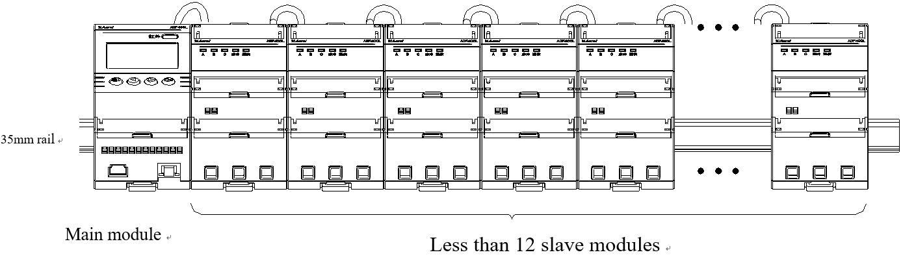
*Slave module (direct access or transformer access module) size*

> _Description (added for context): Same **≈72 × 115 × 79.5 mm** footprint as the main module, but instead of an LCD and keys the front has status LEDs labelled **A, B, C** (phases), **脉冲 (pulse)** and **通信 (communication)**._

### 5.2 Module combination installation method

The connection method between the master module and the slave module is connected by a network cable, and the connection network cable needs to use the meter's own network cable.

#### 5.2.1 The slave modules are directly connected to the module

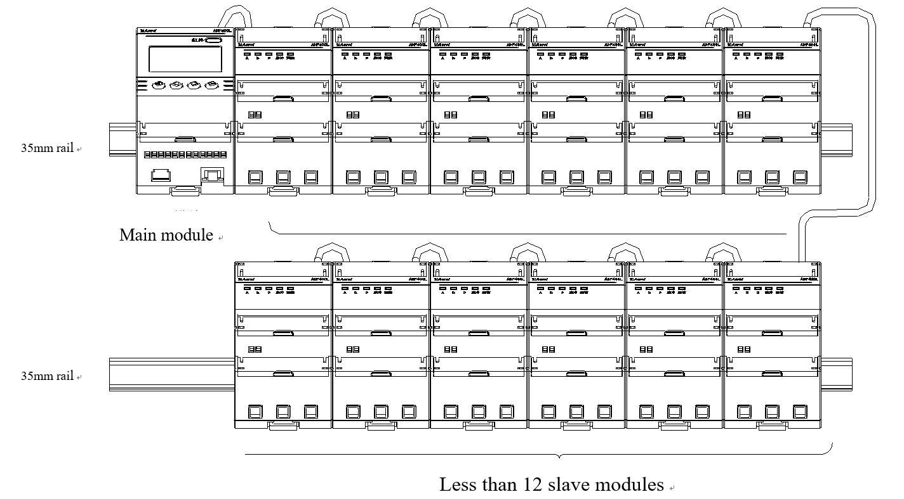
*Single row connection diagram*

> _Description (added for context): Single-row layout on one 35 mm DIN rail — the main module on the left followed by **up to 12 direct-access slave modules**, daisy-chained with the meter's own network (RJ45) cable._

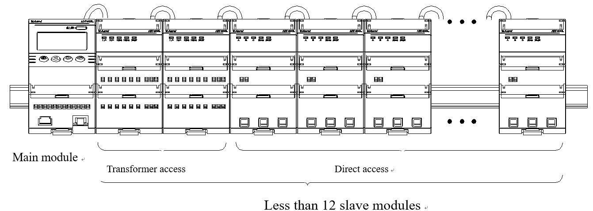
*Double row connection diagram*

> _Description (added for context): When one rail is not enough, the modules are split into **two rows** and the rows are linked with the network cable; the same "main module first" ordering applies._

**Note:**
1. When the module is installed in multiple rows, refer to the connection method of double row installation in 5.2.1.
2. When there are three-phase and single-phase applications in the module at the same time, the order of arrangement is: main module → three-phase direct access module → single-phase direct access module.

#### 5.2.2 The slave modules are all transformer access modules

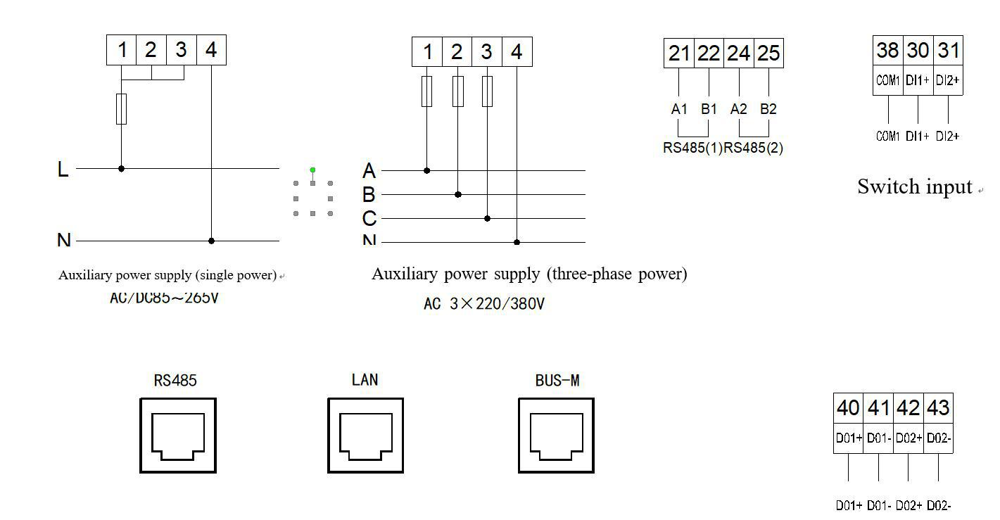
*Transformer access modules connection — Main module + N less than 6 slave modules*

> _Description (added for context): Main module followed by **up to 6 transformer-access slave modules** — fewer per row than direct modules because each transformer module handles two three-phase circuits through external CTs._

**Note:** Refer to the connection method of double-row installation in 5.2.1 when the module is installed in multiple rows.

#### 5.2.3 The slave module is a mixed connection of the secondary access measurement module and the direct access measurement module

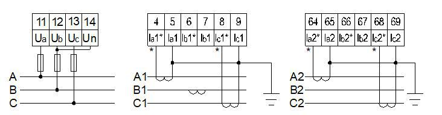
*Mixed connection diagram*

> _Description (added for context): A single mixed row — **main module → transformer-access modules → direct-access modules** (up to ~12 slave modules in total)._

**Note:**
1. When the module is installed in multiple rows, please refer to 5.2.1 for the connection method of double row installation.
2. When there are three-phase and single-phase applications in the direct module at the same time, the order of arrangement is: main module → mutual inductor access module → three-phase direct access module → single-phase direct access module.

---

## 6 Wiring and installation

### 6.1 Main module

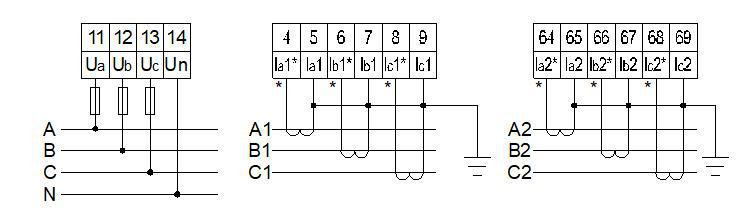
*Main module wiring diagram*

> _Description (added for context): Main-module terminals — **auxiliary power input** (single-phase AC 220–265 V on terminals 1–4 with L/N, or three-phase 3×220/380 V with A/B/C); **two RS485 ports** (terminals 21/22/24/25 = A1 B1 / A2 B2); **DI/DO switch terminals** (38–43, DI1/DI2 and DO1/DO2); and **RJ45 sockets** for RS485 / LAN / BUS-W extension._

### 6.2 Transformer access module

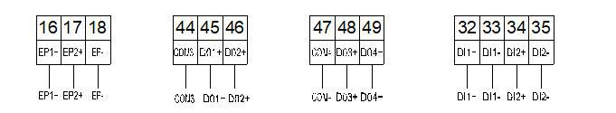
*Transformer access module wiring diagram*

> _Description (added for context): Transformer-access module — **voltage signal input** (terminals 11–14 = Ua Ub Uc Un) and **two independent three-phase current-input groups** (terminals 4–9 and 64–69, each an in/out pair per phase), drawn for both three-phase three-wire and four-wire. Also shown: **energy pulse output** (16–18), the **relay outputs / DI inputs**, and the **Modbus port** (BUS-S1 / BUS-S2) with power supply._

*(Refer to the wiring diagram above for transformer access module terminal connections — voltage signal input, current inputs, and relay outputs)*

**Three-phase three-wire / Three-phase four-wire**

**Modbus Communication port (with power supply)**

### 6.3 Direct access to the module

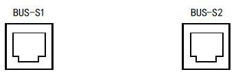
*Three-phase four-wire connection*

> _Description (added for context): Direct-access three-phase four-wire — each phase current passes through its **L/L′ terminal pair** (L1 L1′, L2 L2′, L3 L3′) with the neutral on **N**; supply is A/B/C/N._

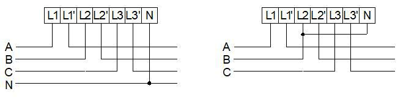
*Three-phase three-wire wiring*

> _Description (added for context): Direct-access three-phase three-wire — same **L/L′ pass-through** current path but **without neutral** (A/B/C only)._

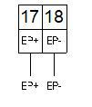
*Active energy pulse output*

> _Description (added for context): Active-energy pulse output on **terminals 17/18 (E1+ / EP−)** of the direct-access module._

### 6.4 Wiring diagram

> **Note:** When directly connecting to the module, the N-wire must be connected. Pay attention to the position of the N-wire (two N-wire terminals are connected).

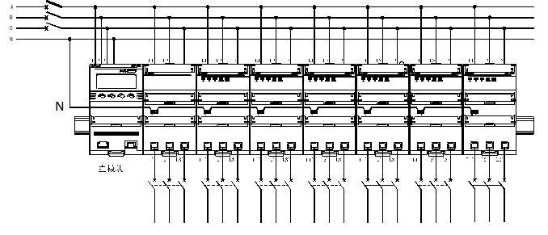
*2 channels of three items direct access diagram*

> _Description (added for context): System example — a three-phase bus (L1/L2/L3/N) feeds the main module plus **two three-phase direct-access modules** through upstream breakers; the N wire must be connected (two N terminals)._

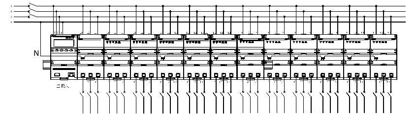
*36-channel single item direct access diagram*

> _Description (added for context): System example — a three-phase + N bus distributing **36 single-phase direct-access channels** across the slave modules._

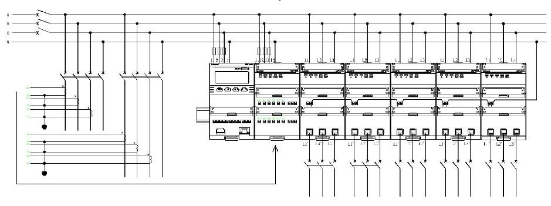
*2 channels of transformer access + 2 channels of three items direct access + 6 channels of single item direct input*

> _Description (added for context): System example combining **2 transformer-access channels** (via external CTs) **+ 2 three-phase direct channels + 6 single-phase direct channels** from one supply._

### 6.5 Wiring inspection

When there are three-phase and single-phase in the module, the sequence is: Main module → Transformer access module → Three-phase direct access module → Single-phase direct access module. Generally, there will be serial numbers on the slave modules when they leave the factory, which can be accessed according to the sequence of serial numbers on the slave modules.

After successful wiring, power on inspection is needed to ensure normal communication between master module and slave module. First, make sure that the number of loops is set correctly. You can press the second key from the left of the main module to switch the number of households to check whether the number of households displayed in the main module corresponds to the actual access. Then, you can press the second key from the left of the main module to switch the number of households to check whether the communication of each household is normal. Under normal circumstances, the blank below the number of households means that the communication is normal. If there is an error under the account number, check it according to the following table:

| Display | Error description |
|:--------|:------------------|
| Err1 | Same type module address error |
| Err2 | Module location does not match module type |
| Err3 | Module missing |

---

## 7 Function Description

### 7.1 Energy metering

The multi-user electric energy meter can measure the total power consumption (forward + reverse), forward power consumption and reverse power consumption of each user.

### 7.2 Relay control (prepaid type only)

#### 7.2.1 No fee shutdown (prepaid control)

The multi-user electric energy meter can be set to alarm power 1 and alarm power 2. When the user uses electricity, the user's total power consumption is incremented, and the user's remaining power is decremented. When the user's remaining power is less than the alarm power 1, the LCD displays "please buy electricity". When the remaining power is less than the alarm power 2, the electric energy meter will automatically switch off the power, and the power supply can be restored after a period of time. Recovery time can be set to 0–255 s, the value is 0 without power.

#### 7.2.2 Timed power-off (time control)

The multi-user electric energy meter can control the user's electricity consumption time. The electric energy meter can set the automatic power-off and power-on time through the background management software to facilitate the user's electricity management.

#### 7.2.3 Overload power failure (negative control)

The multi-user electric energy meter can set the user's maximum load power. When the user's actual power is greater than the set value, the electric energy meter automatically cuts off the power supply circuit of the user, the power does not exceed the maximum load power set value, and the customer has a vicious load identification requirement. The electric energy meter can automatically judge. If it is judged to be a vicious load, the user's power supply will be cut off. After a period of time (settable), the power supply can be automatically restored.

#### 7.2.4 Forced power off (forced control)

The multi-user electric energy meter can be controlled by the back-end management system for forced power off and power transmission, so that the management center can handle emergencies in time.

> **Note:** Among the above four controls, when the forced control is turned on, the other controls are invalid.

---

## 8 Show description

Under normal circumstances, the energy meter will display the remaining amount and power consumption by default after power-on, as shown in Figure 1, Figure 2, and Figure 3. There are also two modes of swiping card display and button display. When the energy meter is in the card swiping display mode and swiping the card is wrong, the button display is invalid.

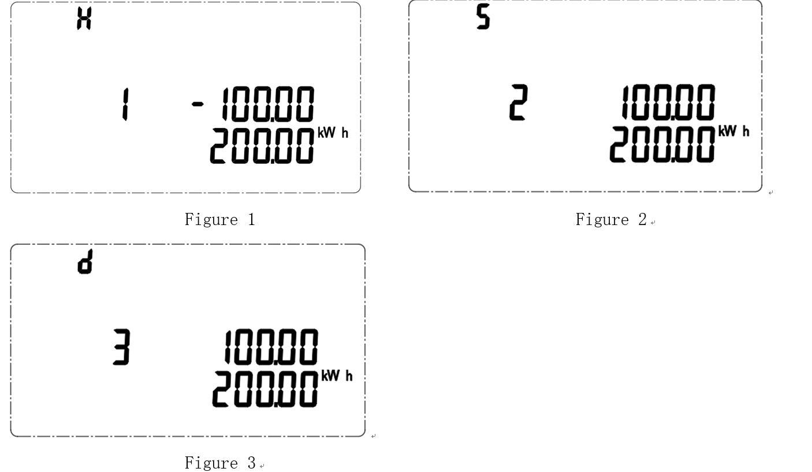
*Figure 1 (H — transformer access user, tripped, −100 yuan / 200 kWh), Figure 2 (S — three-phase user, 100 yuan / 200 kWh), Figure 3 (d — single-phase user, 100 yuan / 200 kWh)*

The top-left indicator on the LCD shows the user type: **H** = transformer (mutual inductor) access, **S** = three-phase, **d** = single-phase. The lower line shows the remaining amount and the power consumption (kWh).

- **Figure 1** (indicator **H**): User 1 is a transformer access user, currently tripped, power consumption is 200 kWh, and the remaining amount is negative 100 yuan.
- **Figure 2** (indicator **S**): User 2 is a three-phase user, currently not tripped, power consumption is 200 kWh, and the remaining amount is 100 yuan.
- **Figure 3** (indicator **d**): User 3 is a single-phase user, currently not tripped, power consumption is 200 kWh, and the remaining amount is 100 yuan.

### 8.1 Swipe card display (only available with IC card swipe function)

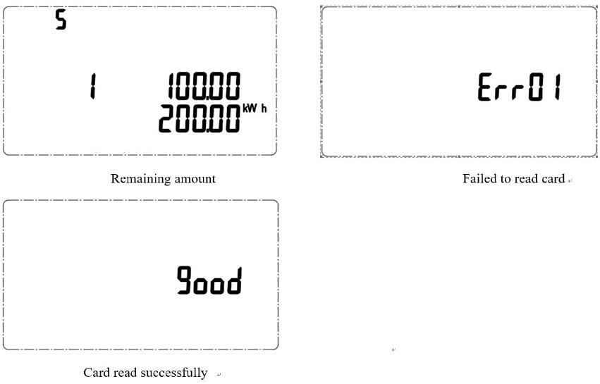

In the remaining amount interface, press the **[↵ Enter]** button to enter card-reading mode. Multiple card swiping operations can be performed within 10 seconds. However, you cannot re-swipe the card after the card is successfully swiped. If the card is wrong, you can continue to swipe the card. The figure above shows the three possible states:

- **Remaining amount** — normal balance screen (e.g. user 1, remaining 100.00, consumption 200.00 kWh).
- **Failed to read card** — shows an error code such as `Err01` (see table below).
- **Card read successfully** — shows `good`.

If the card is incorrectly swiped, the energy meter shows that the card reading fails, and the error code and meaning correspond to the following:

| Error code | Meaning |
|:-----------|:--------|
| Err01 | Write back failure |
| Err02 | Data error |
| Err03 | Undefined card |
| Err04 | This account opening card has been used |
| Err10 | Insert the account opening card into the opened account meter |
| Err11 | Insert the electricity purchase card into the meter without an account |
| Err12 | User card error |
| Err13 | Wrong number of purchases |
| Err14 | Non-present card |
| Err15 | Wrong account card type |

### 8.2 Key display example

Each screen shows the user number followed by two measured values (the top-left indicator shows the user type **H/S/d**). The 16 measurement screens, in display order, are:

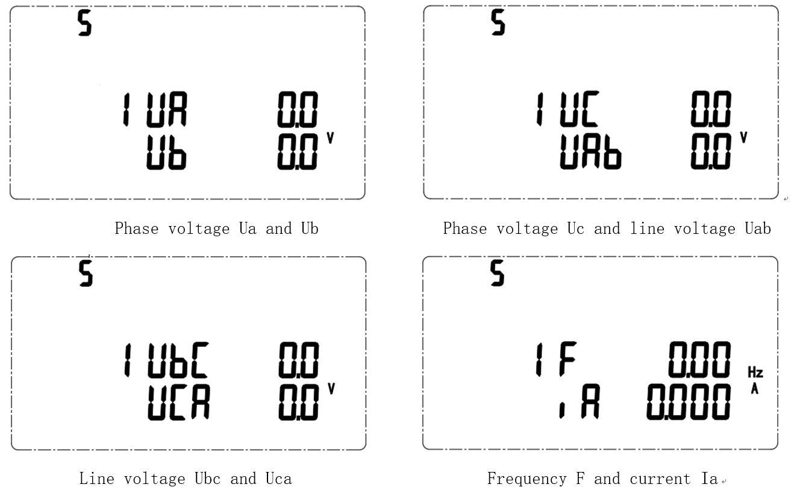
*Screens 1–4 — Phase voltage Ua/Ub, Phase voltage Uc / line voltage Uab, Line voltage Ubc/Uca, Frequency F / current Ia*

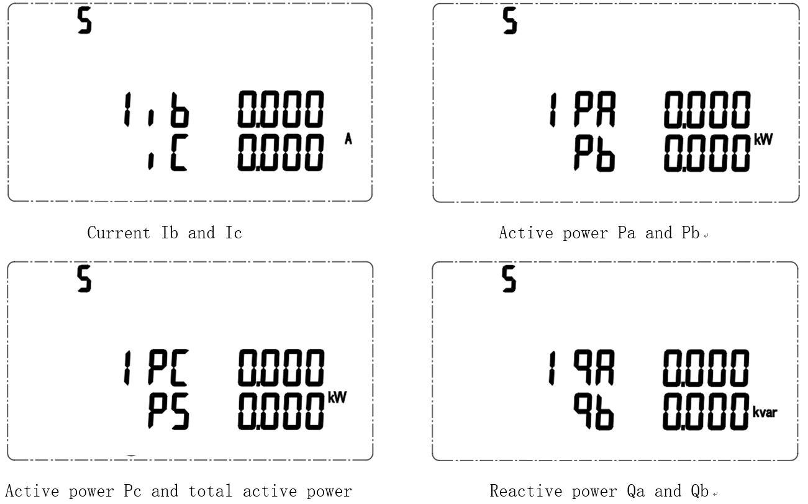
*Screens 5–8 — Current Ib/Ic, Active power Pa/Pb, Active power Pc / total active power, Reactive power Qa/Qb*

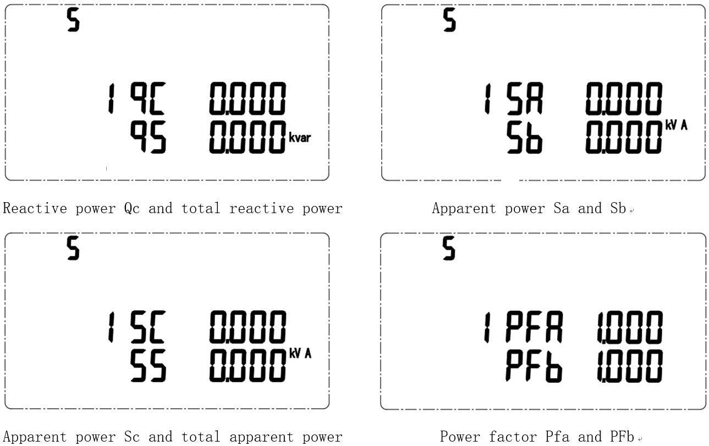
*Screens 9–12 — Reactive power Qc / total reactive power, Apparent power Sa/Sb, Apparent power Sc / total apparent power, Power factor PFa/PFb*

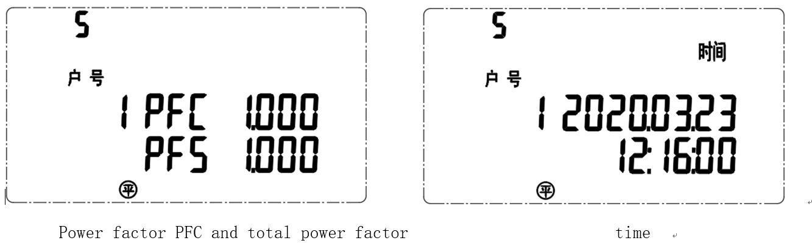
*Screens 13–14 — Power factor PFc / total power factor, Date / time (e.g. 2020.03.23 / 12:16:00)*

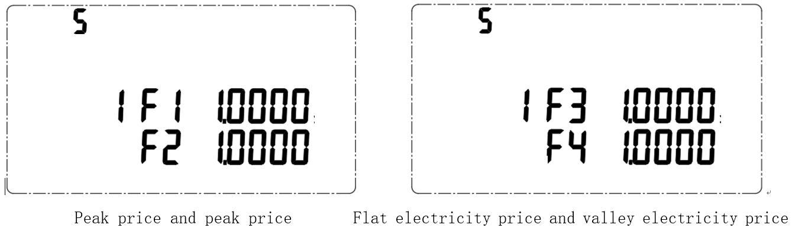
*Screens 15–16 — Tip price F1 / peak price F2, Flat price F3 / valley price F4 (yuan/kWh)*

The full display sequence is summarized below:

| # | Screen content | Values shown |
|:--|:---------------|:-------------|
| 1 | Ua, Ub | Phase voltage Ua and Ub (V) |
| 2 | Uc, Uab | Phase voltage Uc and line voltage Uab (V) |
| 3 | Ubc, Uca | Line voltage Ubc and Uca (V) |
| 4 | F, Ia | Frequency F (Hz) and current Ia (A) |
| 5 | Ib, Ic | Current Ib and Ic (A) |
| 6 | Pa, Pb | Active power Pa and Pb (kW) |
| 7 | Pc, Ps | Active power Pc and total active power (kW) |
| 8 | Qa, Qb | Reactive power Qa and Qb (kvar) |
| 9 | Qc, Qs | Reactive power Qc and total reactive power (kvar) |
| 10 | Sa, Sb | Apparent power Sa and Sb (kVA) |
| 11 | Sc, Ss | Apparent power Sc and total apparent power (kVA) |
| 12 | PFa, PFb | Power factor PFa and PFb |
| 13 | PFc, PFs | Power factor PFc and total power factor |
| 14 | Date / time | e.g. 2020.03.23 / 12:16:00 |
| 15 | F1, F2 | Tip price and peak price (yuan/kWh) |
| 16 | F3, F4 | Flat price and valley price (yuan/kWh) |

### 8.3 Display switching operation

The remaining amount is displayed by default after power-on. The three types of view keys can be used to display the screen. The order of various display interfaces is described as follows:

> _Note: the original manual shows only the two button icons below (no flow diagram in this section)._

- **[◄] Switch user:** moves to the next user.
- **Measurement scroll key:** cycles through the per-user screens in this order — remaining amount and total active power consumption, phase voltage, line voltage, frequency, current, active power, reactive power, apparent power, power factor, time, electricity price.

### 8.4 Button programming

Under any display item in the measurement display menu, press **[SET]** to display "0000", prompting you to enter the password (password default 0001), and then press **[↵ Enter]**. If the password is entered incorrectly, it will return to the initial interface; if the password is entered correctly, you can set the parameters. After setting, press **[SET]** to enter the "SAvE" interface. Press **[↵ Enter]** to show the "YES" / "NO" options: with "YES", press **[↵ Enter]** to save and exit; with "NO", press **[↵ Enter]** to exit without saving.

The programming menu list is as follows:

> The "First level menu" column shows the code displayed on the LCD (7-segment font). For most items the second-level menu is "/" (none); `PtCt` and `CESEt` are submenus that contain several second-level items.

| First level menu | Second level menu | Meaning | Range |
|:-----------------|:------------------|:--------|:------|
| Addr 1 | / | Mailing address settings 1 | 1, 37, 73, 109 (add sequentially +36) … |
| bAUd 1 | / | Baud rate selection 1 | 9600, 4800, 2400, 1200 |
| Addr 2 | / | Mailing address settings 2 | 1, 37, 73, 109 (add sequentially +36) … |
| bAUd 2 | / | Baud rate selection 2 | 9600, 4800, 2400, 1200 |
| CodE | / | Password setting | 0–9999 |
| bLt.AE | / | Backlight setting | 0–999 |
| FCEn | / | Strong control enable | 0: Disable, 1: Enable, 2: Invalid |
| FCStA | / | Strong control state | 0: Disconnect, 1: Closure, 2: Invalid |
| HPHnUn | / | Number of transformer access circuits | 0, 2, 4, 6, 8, 10, 12 |
| SPHnUn | / | Number of three-phase circuits | 0–12 |
| dPHnUn | / | Number of single-phase circuits | 0–36 |
| do | / | Relay settings | L: Level output, P: Pulse output |
| LinE | / | Line selection | 3P4L: Three-phase four-wire, 3P3L: Three-phase three-wire |
| PtCt | Pt | Voltage transformation ratio setting | 1–9999 |
| PtCt | Ct1 | Current ratio setting 1 | 1–9999 |
| PtCt | Ct2 | Current ratio setting 2 | 1–9999 |
| PtCt | Ct3 | Current ratio setting 3 | 1–9999 |
| PtCt | Ct4 | Current ratio setting 4 | 1–9999 |
| PtCt | Ct5 | Current ratio setting 5 | 1–9999 |
| PtCt | Ct6 | Current ratio setting 6 | 1–9999 |
| PtCt | Ct7 | Current ratio setting 7 | 1–9999 |
| PtCt | Ct8 | Current ratio setting 8 | 1–9999 |
| PtCt | Ct9 | Current ratio setting 9 | 1–9999 |
| PtCt | Ct10 | Current ratio setting 10 | 1–9999 |
| PtCt | Ct11 | Current ratio setting 11 | 1–9999 |
| PtCt | Ct12 | Current ratio setting 12 | 1–9999 |
| dbUGPASS | / | Debug function settings | 0–9999 (6606: Slave address rearrangement) |
| CESEt | GAtE.IP1 | Gateway IP address 1, 2 | — |
| CESEt | GAtE.IP2 | Gateway IP address 3, 4 | — |
| CESEt | nASb1 | Subnet mask 1, 2 | — |
| CESEt | nASb2 | Subnet mask 3, 4 | — |
| CESEt | iP1 | Local IP address 1, 2 | — |
| CESEt | iP2 | Local IP address 3, 4 | — |
| CESEt | Port | Port | — |
| EnCrYPt | / | Encryption switch settings | on: encryption on, oFF: encryption off |
| UEr | / | Software number and version number | — |

---

## 9 Communication description

### 9.1 Communication interface

ADF400L series main module supports up to 3 RS485 communication interfaces, 1 infrared interface, and 1 CE Ethernet interface.

### 9.2 Letter of agreement

The RS485 interface of this energy meter supports MODBUS and the Ethernet interface supports MODBUS-TCP protocol. For the specific protocol format, please refer to the relevant protocol standards, which will not be repeated here.

### 9.3 MODBUS communication address description

The address interval between each adjacent transformer access user and the three-phase user is 3, and the address interval for each single-phase user is 1.

Assuming that the table number is 1, there are 4 households with transformers connected, 4 households with three-phase direct access, and 12 households with single-phase direct access, then the transformer access user addresses are 1, 4, 7, 10, three-phase user addresses are 13, 16, 19, 22, and the single-phase user address is 25, 26, 27, ... 36.

The meter number can be set by communication, the meter number connected to the same bus must be different, and the value of the meter number 1, 37, 73 ….

### 9.4 MODBUS communication address table

#### Single-phase data area (0x0300–0x0320)

> Length 2 = one 16-bit register; length 4 = two consecutive registers. U = unsigned integer, I = signed integer.

| Initial address | Data item | R/W | Length | Base unit | Remarks |
|:---------------|:----------|:---:|:------:|:----------|:--------|
| 0x0300 | Single phase voltage | R | 2 | 0.1 V | U |
| 0x0301 | Single phase current | R | 2 | 0.01 A | U |
| 0x0302 | Single-phase active power | R | 2 | 0.001 kW | I |
| 0x0303 | Single phase reactive power | R | 2 | 0.001 kvar | I |
| 0x0304 | Single phase power factor | R | 2 | 0.001 | I |
| 0x0305 | Single phase frequency | R | 2 | 0.01 Hz | U |
| 0x0306 | Single-phase active energy | R | 4 | 0.01 kWh | U |
| 0x0308 | Single-phase reactive energy | R | 4 | 0.01 kvarh | U |
| 0x030A | Single-phase residual energy | R | 4 | 0.01 kWh | I |
| 0x030C | Single-phase total power purchase | R | 4 | 0.01 kWh | U |
| 0x030E | Single-phase power purchases | R | 2 | / | U |
| 0x030F | Single-phase basic electricity | R | 4 | 0.01 kWh | U |
| 0x0311 | Single-phase status word | R | 2 | / | U |
| 0x0312 | Single-phase basic power remaining | R | 4 | 0.01 kWh | I |
| 0x0314 | Reserved | R | 2 | / | U |
| 0x0315 | Single-phase over-limit amount | R | 4 | | U |
| 0x0317 | Recovery Time | R | 2 | / | U |
| 0x0318 | Recovery time overload value | R | 2 | 1 s | U |
| 0x0319 | Single-phase positive active energy | R | 4 | 0.01 kWh | U |
| 0x031B | Unidirectional active energy | R | 4 | 0.01 kWh | U |
| 0x031D | Single-phase forward reactive energy | R | 4 | 0.01 kvarh | U |
| 0x031F | Single-phase reverse reactive energy | R | 4 | 0.01 kvarh | U |

#### Three-phase data area (0x033F–0x0396)

| Initial address | Data item | R/W | Length | Base unit | Remarks |
|:---------------|:----------|:---:|:------:|:----------|:--------|
| 0x033F | A Phase voltage | R | 2 | 0.1 V | U |
| 0x0340 | B Phase voltage | R | 2 | 0.1 V | U |
| 0x0341 | C Phase voltage | R | 2 | 0.1 V | U |
| 0x0342 | A Phase current | R | 2 | 0.01 A | U |
| 0x0343 | B Phase current | R | 2 | 0.01 A | U |
| 0x0344 | C Phase current | R | 2 | 0.01 A | U |
| 0x0345 | Total active power | R | 2 | 1 W | I |
| 0x0346 | A Phase active power | R | 2 | 0.001 kW | I |
| 0x0347 | B Phase active power | R | 2 | 0.001 kW | I |
| 0x0348 | C Phase active power | R | 2 | 0.001 kW | I |
| 0x0349 | Total reactive power | R | 2 | 0.001 kvar | I |
| 0x034A | A Phase reactive power | R | 2 | 0.001 kvar | I |
| 0x034B | B Phase reactive power | R | 2 | 0.001 kvar | I |
| 0x034C | C Phase reactive power | R | 2 | 0.001 kvar | I |
| 0x034D | Total power factor | R | 2 | 0.001 | I |
| 0x034E | A Phase power factor | R | 2 | 0.001 | I |
| 0x034F | B Phase power factor | R | 2 | 0.001 | I |
| 0x0350 | C Phase power factor | R | 2 | 0.001 | I |
| 0x0351 | Frequency | R | 2 | 0.01 Hz | U |
| 0x0352 | A Phase active energy | R | 4 | 0.01 kWh | U |
| 0x0354 | B Phase active energy | R | 4 | 0.01 kWh | U |
| 0x0356 | C Phase active energy | R | 4 | 0.01 kWh | U |
| 0x0358 | A Phase reactive energy | R | 4 | 0.01 kvarh | U |
| 0x035A | B Phase reactive energy | R | 4 | 0.01 kvarh | U |
| 0x035C | C Phase reactive energy | R | 4 | 0.01 kvarh | U |
| 0x035E | Total active energy | R | 4 | 0.01 kWh | U |
| 0x0360 | Total reactive energy | R | 4 | 0.01 kvarh | U |
| 0x0362 | Remaining amount | R | 4 | 0.01 yuan | I |
| 0x0364 | Total purchase amount | R | 4 | 0.01 yuan | U |
| 0x0366 | Number of power purchases | R | 2 | / | U |
| 0x0367 | Base amount | R | 4 | 0.01 yuan | U |
| 0x0369 | Running status word | R | 2 | / | U |
| 0x036A | Basic battery remaining | R | 4 | 0.01 yuan | U |
| 0x036C | Reserved | R | 2 | / | U |
| 0x036D | Overdraft amount | R | 2 | / | U |
| 0x036F | Recovery Time | R | 2 | 1 s | U |
| 0x0370 | Recovery time overload value | R | 2 | 1 s | U |
| 0x0371 | AB Line voltage | R | 2 | 0.1 V | U |
| 0x0372 | BC Line voltage | R | 2 | 0.1 V | U |
| 0x0373 | CA Line voltage | R | 2 | 0.1 V | U |
| 0x0374 | Zero sequence current | R | 2 | 0.1 A | U |
| 0x0375 | Voltage unbalance | R | 2 | 0.01 | U |
| 0x0376 | Current unbalance | R | 2 | 0.01 | U |
| 0x0377 | A Phase positive active energy | R | 4 | 0.01 kWh | U |
| 0x0379 | A Reverse phase active energy | R | 4 | 0.01 kWh | U |
| 0x037B | B Phase positive active energy | R | 4 | 0.01 kWh | U |
| 0x037D | B Reverse phase active energy | R | 4 | 0.01 kWh | U |
| 0x037F | C Phase positive active energy | R | 4 | 0.01 kWh | U |
| 0x0381 | C Reverse phase active energy | R | 4 | 0.01 kWh | U |
| 0x0383 | A Phase positive reactive energy | R | 4 | 0.01 kvarh | U |
| 0x0385 | A Reverse phase reactive energy | R | 4 | 0.01 kvarh | U |
| 0x0387 | B Phase positive reactive energy | R | 4 | 0.01 kvarh | U |
| 0x0389 | B reverse phase reactive energy | R | 4 | 0.01 kvarh | U |
| 0x038B | C Phase positive reactive energy | R | 4 | 0.01 kvarh | U |
| 0x038D | C reverse phase reactive energy | R | 4 | 0.01 kvarh | U |
| 0x038F | Total positive active energy | R | 4 | 0.01 kWh | U |
| 0x0391 | Total reverse phase active energy | R | 4 | 0.01 kWh | U |
| 0x0393 | Total positive reactive energy | R | 4 | 0.01 kvarh | U |
| 0x0395 | Total reverse phase reactive energy | R | 4 | 0.01 kvarh | U |

#### Multiple rate area (0x0400–0x045F)

| Initial address | Data item | R/W | Length | Unit | Remarks |
|:---------------|:----------|:---:|:------:|:-----|:--------|
| 0x0400 | Single-phase active tip electric energy | R | 4 | 0.01 kWh | U |
| 0x0401 | | | | | |
| 0x0402 | Single-phase active peak energy | R | 4 | 0.01 kWh | U |
| 0x0403 | | | | | |
| 0x0404 | Single-phase active flat energy | R | 4 | 0.01 kWh | U |
| 0x0405 | | | | | |
| 0x0406 | Single-phase active valley electric energy | R | 4 | 0.01 kWh | U |
| 0x0407 | | | | | |
| 0x0408 | Single-phase reactive tip electric energy | R | 4 | 0.01 kvarh | U |
| 0x0409 | | | | | |
| 0x040A | Single-phase reactive peak energy | R | 4 | 0.01 kvarh | U |
| 0x040B | | | | | |
| 0x040C | Single-phase reactive flat energy | R | 4 | 0.01 kvarh | U |
| 0x040D | | | | | |
| 0x040E | Single-phase reactive valley electric energy | R | 4 | 0.01 kvarh | U |
| 0x040F | | | | | |
| 0x0410 | Single-phase forward active tip energy | R/W | 4 | 0.01 kWh | U |
| 0x0411 | | | | | |
| 0x0412 | Single-phase forward active peak energy | R/W | 4 | 0.01 kWh | U |
| 0x0413 | | | | | |
| 0x0414 | Single-phase forward active flat energy | R/W | 4 | 0.01 kWh | U |
| 0x0415 | | | | | |
| 0x0416 | Single-phase forward active valley energy | R/W | 4 | 0.01 kWh | U |
| 0x0417 | | | | | |
| 0x0418 | Single-phase reverse active tip electric energy | R/W | 4 | 0.01 kWh | U |
| 0x0419 | | | | | |
| 0x041A | Single-phase reverse active peak energy | R/W | 4 | 0.01 kWh | U |
| 0x041B | | | | | |
| 0x041C | Single-phase reverse active flat energy | R/W | 4 | 0.01 kWh | U |
| 0x041D | | | | | |
| 0x041E | Single phase reverse active valley energy | R/W | 4 | 0.01 kWh | U |
| 0x041F | | | | | |
| 0x0420 | Single-phase forward reactive tip energy | R/W | 4 | 0.01 kvarh | U |
| 0x0421 | | | | | |
| 0x0422 | Single-phase forward reactive peak energy | R/W | 4 | 0.01 kvarh | U |
| 0x0423 | | | | | |
| 0x0424 | Single-phase forward reactive flat energy | R/W | 4 | 0.01 kvarh | U |
| 0x0425 | | | | | |
| 0x0426 | Single-phase positive reactive valley energy | R/W | 4 | 0.01 kvarh | U |
| 0x0427 | | | | | |
| 0x0428 | Single-phase reverse reactive tip electric energy | R/W | 4 | 0.01 kvarh | U |
| 0x0429 | | | | | |
| 0x042A | Single-phase reverse reactive peak energy | R/W | 4 | 0.01 kvarh | U |
| 0x042B | | | | | |
| 0x042C | Single-phase reverse reactive flat energy | R/W | 4 | 0.01 kvarh | U |
| 0x042D | | | | | |
| 0x042E | Single phase reverse reactive valley energy | R/W | 4 | 0.01 kvarh | U |
| 0x042F | | | | | |
| 0x0430 | Three-phase active tip electric energy | R | 4 | 0.01 kWh | U |
| 0x0431 | | | | | |
| 0x0432 | Three-phase active peak energy | R | 4 | 0.01 kWh | U |
| 0x0433 | | | | | |
| 0x0434 | Three-phase active flat energy | R | 4 | 0.01 kWh | U |
| 0x0435 | | | | | |
| 0x0436 | Three-phase active valley electric energy | R | 4 | 0.01 kWh | U |
| 0x0437 | | | | | |
| 0x0438 | Three-phase reactive tip electric energy | R | 4 | 0.01 kvarh | U |
| 0x0439 | | | | | |
| 0x043A | Three-phase reactive peak energy | R | 4 | 0.01 kvarh | U |
| 0x043B | | | | | |
| 0x043C | Three-phase reactive flat energy | R | 4 | 0.01 kvarh | U |
| 0x043D | | | | | |
| 0x043E | Three-phase reactive valley electric energy | R | 4 | 0.01 kvarh | U |
| 0x043F | | | | | |
| 0x0440 | Three-phase forward active tip energy | R/W | 4 | 0.01 kWh | U |
| 0x0441 | | | | | |
| 0x0442 | Three-phase forward active peak energy | R/W | 4 | 0.01 kWh | U |
| 0x0443 | | | | | |
| 0x0444 | Three-phase forward active flat energy | R/W | 4 | 0.01 kWh | U |
| 0x0445 | | | | | |
| 0x0446 | Three-phase positive active valley electric energy | R/W | 4 | 0.01 kWh | U |
| 0x0447 | | | | | |
| 0x0448 | Three-phase reverse active tip electric energy | R/W | 4 | 0.01 kWh | U |
| 0x0449 | | | | | |
| 0x044A | Three-phase reverse active peak energy | R/W | 4 | 0.01 kWh | U |
| 0x044B | | | | | |
| 0x044C | Three-phase reverse active flat energy | R/W | 4 | 0.01 kWh | U |
| 0x044D | | | | | |
| 0x044E | Three-phase reverse active valley energy | R/W | 4 | 0.01 kWh | U |
| 0x044F | | | | | |
| 0x0450 | Three-phase forward reactive tip electric energy | R/W | 4 | 0.01 kvarh | U |
| 0x0451 | | | | | |
| 0x0452 | Three-phase forward reactive peak energy | R/W | 4 | 0.01 kvarh | U |
| 0x0453 | | | | | |
| 0x0454 | Three-phase forward reactive flat energy | R/W | 4 | 0.01 kvarh | U |
| 0x0455 | | | | | |
| 0x0456 | Three-phase forward reactive valley electric energy | R/W | 4 | 0.01 kvarh | U |
| 0x0457 | | | | | |
| 0x0458 | Three-phase reverse reactive tip electric energy | R/W | 4 | 0.01 kvarh | U |
| 0x0459 | | | | | |
| 0x045A | Three-phase reverse reactive peak energy | R/W | 4 | 0.01 kvarh | U |
| 0x045B | | | | | |
| 0x045C | Three-phase reverse reactive flat energy | R/W | 4 | 0.01 kvarh | U |
| 0x045D | | | | | |
| 0x045E | Three-phase reverse reactive valley energy | R/W | 4 | 0.01 kvarh | U |
| 0x045F | | | | | |

#### Prepaid area (0x0500–0x0547)

| Initial address | Data item | R/W | Length | Base unit | Remarks |
|:---------------|:----------|:---:|:------:|:----------|:--------|
| 0x0500 | Single phase prepaid switch | R/W | 2 | / | U |
| 0x0501 | Single-phase peak price | R/W | 4 | 0.01 yuan/kWh | U |
| 0x0503 | Single-phase peak electricity price | R/W | 4 | 0.01 yuan/kWh | U |
| 0x0505 | Single-phase electricity price | R/W | 4 | 0.01 yuan/kWh | U |
| 0x0507 | Single-phase valley price | R/W | 4 | 0.01 yuan/kWh | U |
| 0x0509 | Single-phase alarm amount 1 | R/W | 4 | 0.01 yuan | U |
| 0x050B | Single-phase alarm amount 2 | R/W | 4 | 0.01 yuan | U |
| 0x050D | Single-phase new power purchase amount | R/W | 4 | 0.01 yuan | U |
| 0x050F | Single-phase power purchases | R/W | 2 | / | U |
| 0x0510 | Single-phase basic amount | R/W | 4 | 0.01 yuan | U |
| 0x0512 | Single phase prepaid switch | R/W | 2 | / | U |
| 0x0536 | Three-phase prepaid switch | R/W | 2 | / | U |
| 0x0537 | Three-phase peak price | R/W | 4 | 0.01 yuan/kWh | U |
| 0x0539 | Three-phase peak electricity price | R/W | 4 | 0.01 yuan/kWh | U |
| 0x053B | Three-phase electricity price | R/W | 4 | 0.01 yuan/kWh | U |
| 0x053D | Three-phase valley electricity price | R/W | 4 | 0.01 yuan/kWh | U |
| 0x053F | Three-phase alarm amount 1 | R/W | 4 | 0.01 yuan | U |
| 0x0541 | Three-phase alarm amount 2 | R/W | 4 | 0.01 yuan | U |
| 0x0543 | Three-phase new power purchase amount | R/W | 4 | 0.01 yuan | U |
| 0x0545 | Three-phase power purchase | R/W | 2 | / | U |
| 0x0546 | Three-phase basic amount | R/W | 4 | 0.01 yuan | U |

#### Time zone area (0x0600–0x0667)

> Each time control table spans 12 registers (8×3): 8 events, each with Switch, Hour and Minute, packed 2 fields per register in the order Switch 1 / Hour 1 / Minute 1 / Switch 2 … Switch 8 / Hour 8 / Minute 8.

| Initial address | Data item | R/W | Length | Base unit | Remarks |
|:---------------|:----------|:---:|:------:|:----------|:--------|
| 0x0600 | Single-phase time control switch | R/W | 2 | / | U |
| 0x0601–0x060C | Single-phase working day time control table | R/W | 8×3 | / | U |
| 0x060D–0x0618 | Single-phase rest day time control table | R/W | 8×3 | / | U |
| 0x0619 | Single phase rest day setting word | R/W | 2 | / | U |
| 0x064E | Three phase time control switch | R/W | 2 | / | U |
| 0x064F–0x065A | Three-phase working day time control table | R/W | 8×3 | / | U |
| 0x065B–0x0666 | Three-phase rest day time control table | R/W | 8×3 | / | U |
| 0x0667 | Three phase rest day setting word | R/W | 2 | / | U |

#### Load control area (0x0700–0x071F)

| Initial address | Data item | R/W | Length | Base unit | Remarks |
|:---------------|:----------|:---:|:------:|:----------|:--------|
| 0x0700 | Single phase load control switch | R/W | 2 | / | U |
| 0x0701 | Single phase maximum power threshold | R/W | 2 | 0.001 kW | U |
| 0x0702 | Single phase active power increment threshold | R/W | 2 | 0.001 kW | U |
| 0x0703 | Single phase power factor threshold | R/W | 2 | / | U |
| 0x0704 | Single phase load control times | R/W | 2 | / | U |
| 0x0705 | Single phase load control allow times | R/W | 2 | / | U |
| 0x0706 | Single phase load control recovery time | R/W | 2 | 10 s | U |
| 0x0707 | Single phase voltage loss threshold | R/W | 2 | 0.1 V | U |
| 0x0718 | Three phase load control switch | R/W | 2 | / | U |
| 0x0719 | Three phase maximum power threshold | R/W | 2 | 0.001 kW | U |
| 0x071A | Three phase active power increment threshold | R/W | 2 | 0.001 kW | U |
| 0x071B | Three phase power factor threshold | R/W | 2 | / | U |
| 0x071C | Three phase load control times | R/W | 2 | / | U |
| 0x071D | Three phase load control allow times | R/W | 2 | / | U |
| 0x071E | Three phase load control recovery time | R/W | 2 | 10 s | U |
| 0x071F | Three phase voltage loss threshold | R/W | 2 | 0.1 V | U |

#### Strong control zone (0x0800–0x0804)

| Initial address | Data item | R/W | Length | Base unit | Remarks |
|:---------------|:----------|:---:|:------:|:----------|:--------|
| 0x0800 | Single three-phase category | R/W | 2 | / | 0: Three-phase, 1: Single-phase |
| 0x0801 | Single-phase strong control's control word | R/W | 2 | / | High bit 1: open, low bit 1: closed |
| 0x0804 | Three-phase strong control's control word | R/W | 2 | / | High bit 1: open, low bit 1: closed |

#### System parameter area (0x0900–0x0972)

> The multiple-rate period tables and the time-zone table are packed structures (2 fields per register). Each multiple-rate table holds 14 periods × (Period, Hour, Minute); the time-zone table holds timetable-number / date (day, month) entries.

| Initial address | Data item | R/W | Length | Base unit | Remarks |
|:---------------|:----------|:---:|:------:|:----------|:--------|
| 0x0900 | Address 1 | R/W | 2 | / | 0~247 |
| 0x0901 | Baud rate 1 | R/W | 2 | / | High Byte: Check digit (0: NONE, 1: ODD, 2: EVEN); Low Byte: Baud Rate (0: 9600, 1: 9600, 2: 4800, 3: 2400, 4: 1200) |
| 0x0902 | Password | R/W | 2 | / | |
| 0x0903 | Number of three-phase circuits directly connected | R/W | 2 | / | 0~12 |
| 0x0904 | Number of single-phase circuits directly connected | R/W | 2 | / | 0~36 |
| 0x0908 | Protocol selection | R/W | 2 | / | High byte: 0: Prepaid, 1: Metering type; Low byte: 0: modbus |
| 0x0909 | Force control mark | R/W | 2 | / | Not enabled |
| 0x090A | Whether the IC card is enabled | R/W | 2 | / | |
| 0x090B | Second/minute | R/W | 2 | / | |
| 0x090C | Hour/week | R/W | 2 | / | |
| 0x090D | Sun / month | R/W | 2 | / | |
| 0x090E | Year/reserved | R/W | 2 | / | |
| 0x090F | Type (number of single-phase circuits) | R/W | 2 | / | 0: 36, 1: 24, 2: 12 |
| 0x0910 | Total number of single-phase circuits | R/W | 2 | / | Total circuit number of cabinet (single phase) |
| 0x0911 | Address 2 | R/W | 2 | / | The second address |
| 0x0912 | Baud rate 2 | R/W | 2 | / | High Byte: Check digit (0: NONE, 1: ODD, 2: EVEN); Low Byte: Baud Rate (0: 9600, 1: 9600, 2: 4800, 3: 2400, 4: 1200) |
| 0x0913 | Vacant lower board control word | R/W | 2 | / | Not Enabled |
| 0x0914–0x0928 | Multiple rate period table 1 | R/W | 14×3 | / | U |
| 0x0929–0x093D | Multiple rate period table 2 | R/W | 14×3 | / | U |
| 0x093E–0x0943 | Time zone table | R/W | 4×3 | / | U |
| 0x0944 | Order number 1, 2 | R/W | 2 | / | U |
| 0x0945 | Order number 3, 4 | R/W | 2 | / | U |
| 0x0946 | Backlight time | R/W | 2 | / | U |
| 0x0947 | Serial number [0][1] | R/W | 2 | / | |
| 0x0948 | Serial number[2][3] | R/W | 2 | / | |
| 0x0949 | Serial number[4][5] | R/W | 2 | / | |
| 0x094A | Serial number[6][7] | R/W | 2 | / | |
| 0x094B | Serial number[8][9] | R/W | 2 | / | |
| 0x094C | Serial number[10][11] | R/W | 2 | / | |
| 0x094D | Serial number[12][13] | R/W | 2 | / | |
| 0x094E | Switch DI state | R | 2 | / | See Table 1 |
| 0x094F | Switch DO status | R/W | 2 | / | See Table 1 |
| 0x0950 | Line selection | R/W | 2 | / | 0: 3P4L, 1: 3P3L |
| 0x0951 | PT | R/W | 2 | / | 1–9999 |
| 0x0952 | CT1 | R/W | 2 | / | 1–9999 |
| 0x0953 | CT2 | R/W | 2 | / | 1–9999 |
| 0x0954 | CT3 | R/W | 2 | / | 1–9999 |
| 0x0955 | CT4 | R/W | 2 | / | 1–9999 |
| 0x0956 | CT5 | R/W | 2 | / | 1–9999 |
| 0x0957 | CT6 | R/W | 2 | / | 1–9999 |
| 0x0958 | CT7 | R/W | 2 | / | 1–9999 |
| 0x0959 | CT8 | R/W | 2 | / | 1–9999 |
| 0x095A | CT9 | R/W | 2 | / | 1–9999 |
| 0x095B | CT10 | R/W | 2 | / | 1–9999 |
| 0x095C | CT11 | R/W | 2 | / | 1–9999 |
| 0x095D | CT12 | R/W | 2 | / | 1–9999 |
| 0x095E | Output method | R/W | 2 | / | 0: L level, 1: P pulse |
| 0x095F | Pulse Width | R/W | 2 | / | Default 500, unit ms |
| 0x0960 | Pulse interval | R/W | 2 | / | Default 30, unit s |
| 0x0961 | Whether wireless is enabled | R/W | 2 | / | 0: Disable, 1: Enable |
| 0x0962 | Number of transformer access circuits | R/W | 2 | / | 0~12 |
| 0x0963 | Slave address rearrangement | R/W | 2 | / | 0: Disable, 1: Enable |
| 0x0964 | Enable CE Ethernet | R/W | 2 | / | 0: Disable, 1: Enable |
| 0x0965 | Address 3 | R/W | 2 | / | The third address |
| 0x0966 | Baud rate 3 | R/W | 2 | / | High Byte: Check digit (0: NONE, 1: ODD, 2: EVEN); Low Byte: Baud Rate (0: 9600, 1: 9600, 2: 4800, 3: 2400, 4: 1200) |
| 0x0967 | Debug information switch | R/W | 2 | / | |
| 0x0968 | Gateway IP[0][1] | R/W | 2 | / | |
| 0x0969 | Gateway IP[2][3] | R/W | 2 | / | |
| 0x096A | Subnet mask [0][1] | R/W | 2 | / | |
| 0x096B | Subnet mask[2][3] | R/W | 2 | / | |
| 0x096C | IP[0][1] | R/W | 2 | / | |
| 0x096D | IP[2][3] | R/W | 2 | / | |
| 0x096E | MAC address[0][1] | R | 2 | / | |
| 0x096F | MAC address[2][3] | R | 2 | / | |
| 0x0970 | MAC address[4][5] | R | 2 | / | |
| 0x0971 | The port number | R/W | 2 | / | |
| 0x0972 | DI debounce time | R/W | 2 | / | |

#### Switch area (0x1800–0x1801)

| Initial address | Data item | R/W | Length | Base unit | Remarks |
|:---------------|:----------|:---:|:------:|:----------|:--------|
| 0x1800 | Switch DI state | R | 2 | / | U |
| 0x1801 | Switch DO status | R/W | 2 | / | U |

#### Harmonic region (0x1900–0x19B9)

> Each phase quantity has a total content rate followed by the 2nd…31st harmonic content rates (31 registers per quantity), in the order: A/B/C phase voltage, then A/B/C phase current.

| Initial address | Data item | R/W | Length |
|:---------------|:----------|:---:|:------:|
| 0x1900 | A phase voltage total harmonic content rate | R | 2 |
| 0x1901 | A phase voltage 2nd harmonic content rate | R | 2 |
| … | A phase voltage 3rd…30th harmonic content rate | R | 2 |
| 0x191E | A phase voltage 31st harmonic content rate | R | 2 |
| 0x191F | B-phase voltage total harmonic content rate | R | 2 |
| … | B-phase voltage 2nd…30th harmonic content rate | R | 2 |
| 0x193D | B-phase voltage 31st harmonic content rate | R | 2 |
| 0x193E | C-phase voltage total harmonic content rate | R | 2 |
| … | C-phase voltage 2nd…30th harmonic content rate | R | 2 |
| 0x195C | C-phase voltage 31st harmonic content rate | R | 2 |
| 0x195D | A phase current total harmonic content rate | R | 2 |
| … | A phase current 2nd…30th harmonic content rate | R | 2 |
| 0x197B | A phase current 31st harmonic content rate | R | 2 |
| 0x197C | B-phase current total harmonic content rate | R | 2 |
| … | B-phase current 2nd…30th harmonic content rate | R | 2 |
| 0x199A | B-phase current 31st harmonic content rate | R | 2 |
| 0x199B | C-phase current total harmonic content rate | R | 2 |
| … | C-phase current 2nd…30th harmonic content rate | R | 2 |
| 0x19B9 | C-phase current 31st harmonic content rate | R | 2 |

#### Historic Power District (0x1A00–0x1A0B)

| Initial address | Data item | R/W | Length | Remarks |
|:---------------|:----------|:---:|:------:|:--------|
| 0x1A00 | Historical energy data for the previous month | R | 20 | Format: Freezing time (year and month), day hour → Active peak energy, Active peak energy, Active flat energy, Active valley energy |
| 0x1A01 | Historical electric energy data for the last two months | R | 20 | |
| 0x1A02 | Historical energy data for the last three months | R | 20 | |
| 0x1A03 | Historical energy data for the last April | R | 20 | |
| 0x1A04 | Historical energy data for the last May | R | 20 | |
| 0x1A05 | Historical electric energy data for last June | R | 20 | |
| 0x1A06 | Historical energy data for the last July | R | 20 | |
| 0x1A07 | Historical energy data for the last August | R | 20 | |
| 0x1A08 | Historical energy data for the last September | R | 20 | |
| 0x1A09 | Historical electrical energy data for the last October | R | 20 | |
| 0x1A0A | Historical energy data for the last November | R | 20 | |
| 0x1A0B | Historical electric energy data for last December | R | 20 | |

#### Recharge record area (0x1B00–0x1B13)

| Initial address | Data item | R/W | Length | Remarks |
|:---------------|:----------|:---:|:------:|:--------|
| 0x1B00 | Last recharge record block | R | 20 | Format: Recharge time (years and months, days and hours, minutes and seconds), Number of power purchases, Power purchase amount, Remaining amount after power purchase, Total power consumption |
| 0x1B01 | Last 2 recharge record blocks | R | 20 | |
| 0x1B02 | Last 3 recharge record blocks | R | 20 | |
| 0x1B03 | Last 4 recharge record blocks | R | 20 | |
| 0x1B04 | Last 5 recharge record blocks | R | 20 | |
| 0x1B05 | Last 6 recharge record blocks | R | 20 | |
| 0x1B06 | Last 7 recharge record blocks | R | 20 | |
| 0x1B07 | Last 8 recharge record blocks | R | 20 | |
| 0x1B08 | Last 9 recharge record blocks | R | 20 | |
| 0x1B09 | Last 10 recharge record blocks | R | 20 | |
| 0x1B0A | Last 11 recharge record blocks | R | 20 | |
| 0x1B0B | Last 12 recharge record blocks | R | 20 | |
| 0x1B0C | Last 13 recharge record blocks | R | 20 | |
| 0x1B0D | Last 14 recharge record blocks | R | 20 | |
| 0x1B0E | Last 15 recharge record blocks | R | 20 | |
| 0x1B0F | Last 16 recharge record blocks | R | 20 | |
| 0x1B10 | Last 17 recharge record blocks | R | 20 | |
| 0x1B11 | Last 18 recharge record blocks | R | 20 | |
| 0x1B12 | Last 19 recharge record blocks | R | 20 | |
| 0x1B13 | Last 20 recharge record blocks | R | 20 | |

---

### Table 1 — DI/DO bit map (0x094E Switch DI state / 0x094F Switch DO status)

| Register (bit) | 9~16 | 8 | 7 | 6 | 5 | 4 | 3 | 2 | 1 |
|:---------------|:----:|:-:|:-:|:-:|:-:|:-:|:-:|:---:|:---:|
| **0x094E** | Reserved | | | | | | | DI2 | DI1 |
| **0x094F** | Reserved | | | | | | | DO2 | DO1 |

> Bits 9–16 are Reserved; bits 3–8 are unused (blank). 0x094E reports the main-module digital-input state (bit 1 = DI1, bit 2 = DI2); 0x094F reports/sets the digital-output state (bit 1 = DO1, bit 2 = DO2).

### Table 2 — Switch Area Control Word (0x1800–0x1801)

| Register (bit) | 9~16 | 8 | 7 | 6 | 5 | 4 | 3 | 2 | 1 |
|:---------------|:----:|:-:|:-:|:-:|:-:|:-:|:-:|:---:|:---:|
| **0x1800** | Reserved | | | | | | | | DI1 |
| **0x1801** | Reserved | | | | | | | DO2 | DO1 |

> In the original manual both rows of Table 2 are mislabelled "1800H"; per the register map (§9.4 *Switch area*) the second row is **0x1801**. The 0x1800 DI row shows only **DI1** at bit 1 (bit 2 blank).

---

## 10 Common troubleshooting

### No communication

- Check whether the communication line connection is reliable, whether 485A, 485B are correspondingly connected.
- Enter the menu setting item to observe whether the address and baud rate options are set correctly.
- Use a multimeter to measure whether the voltage of the 485A and 485B ports is about 4 V. If the cabinet has been connected to the 485 bus, the 485 line of the cabinet must be disconnected from the bus before the measurement.

### The meter measures abnormal voltage and current

- Check whether the wiring is correct and whether the joint is tightly pressed.

### Abnormal power measurement

- Check if the phase sequence of incoming line ABC is correct.

---

## Manual revision record

| Date | Old version | New version | Modify content |
|:----|:-----------|:-----------|:---------------|
| 2020.3.19 | — | V1.0 | 1. First time writing |

> **Note:** The issuance of control-related commands is not detailed in the manual due to space reasons. If necessary, please contact our customer service.

---

## Headquarters

**Acrel Co., LTD.**
Address: No.253 Yulv Road, Jiading District, Shanghai, China
TEL.: 0086-21-69158338 / 0086-21-69156052 / 0086-21-59156392 / 0086-21-69156971
Fax: 0086-21-69158303
Web-site: [www.acrel-electric.com](http://www.acrel-electric.com)
E-mail: ACREL008@vip.163.com
Postcode: 201801

## Manufacturer

**Jiangsu Acrel Electrical Manufacturing Co., LTD.**
Address: No.5 Dongmeng Road, Dongmeng Industrial Park, Nanzha Street, Jiangyin City, Jiangsu Province, China
TEL./Fax: 0086-510-86179970
Web-site: [www.jsacrel.com](http://www.jsacrel.com)
Postcode: 214405
E-mail: JY-ACREL001@vip.163.com
